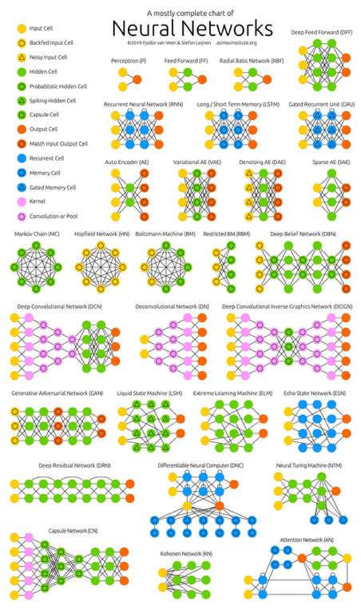

*Transcript of the mini-report “Machines are learning. Do not be afraid, lead!” from [HolyJS 2019 Moscow (Lightning talks)](https://meet.google.com/aby-qudm-uup). It’s best to watch [video](https://youtu.be/8OkhauJfTRI), and there are also [slides](https://www.icloud.com/keynote/0p5KDGimWhZJBd1bf63HS4Uew#machines-learning%2C_react).* **Sorry, but only Russian language...**

Hello! My name is [Roman Ponomarev](https://twitter.com/maksUgr). The next few minutes we will talk about machine learning and how the front-end can plunge into it now.

In the beginning, let's deal with the highest level concepts and their relationship. *Artificial intelligence* is the ability of machines to learn and think like humans. *Machine Learning* - a sub-branch of artificial intelligence based on algorithms that can learn without direct programming. The most popular term is *deep learning* - a subset of machine learning in which artificial neural networks adapt and learn from large amounts of data like the neural networks in our brain.

We don’t need to go far for examples of the use of machine learning: it surrounds us everywhere in everyday life. These are voice assistants in phones, anti-spam in mail, fraudmachines, recommendations in social and dating networks, autonomous cars and even art. Machine learning has penetrated a great many spheres of our life and there is no sphere where it will not penetrate in the future.

Under the hood of all these products, a bunch of types of machine learning algorithms work in conjunction, and now you can see only a part of them related only to neural networks.

However, if we talk about neural networks, the logic of their work is always about the same: layers for incoming data, hidden layers for working with this data and output layers. Very similar to regular pure functions. The main task here is to write, train and correctly position the hidden layers.

For training a neural network, you can use the CPU (the slowest way), the GPU (faster and often the main one) and TPU - a tensor processor from Google, showing the best results in the training of neural networks.

In the languages used to create machine learning algorithms, Python still holds the lead (thanks to its excellent standard library). JavaScript exists among the laggards, but it is developing dynamically and has great potential: it is the only programming language for the browser, and the browser is our everything.

The most popular machine learning library in the browser is [TensorFlow.js](https://www.tensorflow.org/js) - the port in JavaScript is perhaps the most important library in the world of machine learning.

Let's see what the standard development and use of machine learning looks like for a web application: Python writes a network, learns and deploys using all of our favorite tools. JavaScript is here only to pull the backend handles: no machine learning occurs on it. Using TensorFlow.js, absolutely everything happens on the client, no deployment is required (only deliver our script to the browser in the standard way). Conveniently.

This concept does not change if we use not TensorFlow.js, but other JavaScript libraries: [BrainJS](https://github.com/BrainJS), [Face-API](https://github.com/justadudewhohacks/face-api.js/). [Math.js](https://mathjs.org/) may also be useful as a replacement for [NumPy](https://numpy.org/) in the JavaScript world.

Of course, there are ready-made solutions that provide JavaScript libraries for interacting with clouds, for example, [Yandex SpeechKit](https://cloud.yandex.ru/services/speechkit) or [Dialogflow](https://dialogflow.com/) from Google for speech and text recognition.

It is important to understand that if we train our network during a user session, then we will not have enough data and this will be a very long time. The so-called [Transfer learning](https://en.wikipedia.org/wiki/Transfer_learning) helps here, when we pre-train the network on a large data set and deliver it to the browser in this form, and already train it on the data of a specific user in runtime and give him a result specific to him. The only downside is the heavy weight of the pre-trained model.

There are a lot of advantages to machine learning in the browser. It’s easy to share trained and pre-trained networks: this is just another script loaded into a browser. It is very cool that the data does not leave the browser, which is very important from the point of view of privacy and in some cases the only possible option to achieve it. In connection with the transfer of machine learning to the client, a complex deployment leaves, and the calculations are transferred to the client. The network will have access to all sensors that we can use without any delays, since we do not walk around them.

Various nice examples can be given. For example, Pacman in a browser using your body as a controller. It uses a pre-trained network, which you quickly retrain with your movements forward, backward, left, right. There are also various other fun things with a webcam: determining body position and displaying information about a person by face.

However, why I, frontend developer, need it? The future is coming, machine learning has already penetrated into so many areas and it is worth preparing professionally to work with it. In China, for example, knowledge in the field of artificial intelligence is already being asked at interviews and it is not only about IT employees. Machine learning also opens up many new business scenarios. Diving into this topic will allow you to expand your developer experience, go beyond scoping your standard tasks in code and generally entertain you (why not?). You can also become a pioneer, transfer libraries from Python to JavaScript, write your own - the field is not yet plowed. And everything that can be written in JavaScript, as we know, sooner or later will be written on it.
