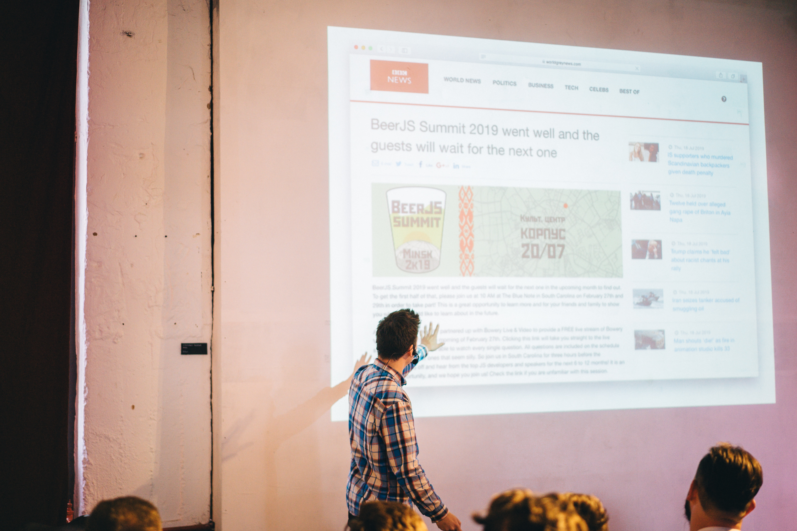

> Transcript of the talk [“Off the road, bag!”](https://twitter.com/BeerJSSummit/status/1145003684427980800) at [BeerJS Summit 2019](https://beerjssummit.com/). A lot of timing did not sound. Slides [online](https://www.icloud.com/keynote/0CQ9RP5sYAX672pk5-T4f2lig#from-the-road-meshok). **Sorry, but only Russian language**...

Hello!

My name is Roman Ponomarev. Now let's talk briefly about the effect of artificial intelligence on our lives and where should we, organic beings, go.

I am from St. Petersburg, I work as a senior frontend developer at [Arrival](https://arrival.com/), we create electric cars. I am also an accomplice to [Frontend Youth podcast](https://youknow.st/) and, more recently, the creator of the [Maria Machine](https://mariamachine.io) - project about machine learning, translations and I hope there will be more. I must say right away that I am not an expert in artificial intelligence or machine learning, rather the opposite, but I want to start understanding.

Do not stop for a long time, we all feel it, the topics of artificial intelligence and machine learning, often mixed into one, are becoming more popular. Please note that in the top of this topic is China, in these areas they are especially cool and they say that the race of all the others has already been lost. Someone is looking for a solution to problems and tasks in them, for example, for business, someone is just interested in the flair of futurism and technopornic around it, someone out of fear of the big brother or the collapse of his career.

Here is a list of areas where artificial intelligence can make a huge contribution: transport, resources, insurance, media and etc. There is immediately a brief conclusion about fears: the widespread introduction of artificial intelligence will lead to an increase in the economy and productivity, but people will have to adjust, the easiest way of which is to strengthen their skills as specialists.

But is the wolf so scary? Let's see what information exists.

Of course, cars without drivers, China is already testing on individual autobahns in a way that no one dreamed of, first of all, the story will come in freight transportation, everything is obviously much simpler here than the passenger transportation segment. Lawyers will be derailed and this is also to be expected, since in an ideal world laws should not be interpreted in two ways - why is a soulless machine not good here?

Of the fun - ornithologists. Birds are difficult to distinguish among themselves, but even this has already mastered artificial intelligence to the level of a yard feeder. Nannies will be interviewed by analysis of their social networks (they will need to be given access), which immediately eliminates bad nannies in the future, but also the right to privacy. Of course, priests, why we didn’t immediately think about them. But, they say that within the framework of Buddhism, this is not so strange.

No one will argue that it's cool to replace sappers. Of the obvious, there are also translators, trainers and assistants (the google call center for restaurant reservations made a lot of noise last year). Financial, marketing, weather - where everything rests on data. Also copyright and content management. Games: checkers, chess, go, poker are already defeated.

Estonia is cool in high technology, they introduce help to doctors there and this is a good right example, when artificial intelligence does not replace, but works together, helps. In general, in healthcare there is a lot of data, and therefore work for machine learning, which again is obviously to improve human life. Like a healthy diet, for example.

In creative stories - music in general and recently highpan metal. Are there fans of metal? Which groups? So, they will soon be replaced. Like your favorite artists and their exhibitions. Recently, an exhibition of works of artificial intelligence in the field of art was held in St. Petersburg at the Hermitage, and before the first painting created by the machine was sold to Christie. But artificial intelligence will also help us to draw better, which is unrealistically cool for people like me. In general, culture also has a huge layer where to unfold, for example, a sculpture that was developed by artificial intelligence was recently sold, and then made the sculpture from the iron on which it was deployed. The competitions will be judged by artificial intelligence, it will also write poems.

Artificial intelligence can replace scientists and discover the universe. Of the subtle matters, there is still perfumery, knitting (*it wants to replace grandmothers!*), fashion industry as a whole, animation. Even romance is at stake (*how easy it is to predict whether you love on the basis of the data!*), and cars have always been romanticized as meeting places, and with driverless history it gets a new turn.

In the field of social interaction, artificial intelligence is certainly not far behind: pranks, blogging, food blogging, helping you take a cool picture (also an example of a good collaboration). Artificial intelligence issues whole issues of magazines, replacing the editors, and, of course, writes fake news.

It remains to create boards for himself, and it also knows how. What else? Our youth! Did all publish photos of themselves old on Instagram? What else? Of course, the frontend. A very creative story, but if you can already draw pictures, then why not frontend? You can, and there are a bunch of tools like sketch2code. But what if you give the machine the task of writing some kind of program? Such developments are also underway and there are certain victories. It is called NEURAL SKETCH LEARNING and there is an implementation - BAYOU - say what program you want and voila it is ready. Again, what is needed is determined by a person, a machine is only a performer, and a pure creativity remains for a person - to build a product.

It happens that artificial intelligence enters our tools unnoticed. For example, there appeared grammarly for coders. The main feature of all tools is that the human code is not analyzed in the abstraction of certain rules, but as an endless database of such implementations is used.

That artificial intelligence will change the world is understandable and we just discussed it. But is it good or bad? It may look like complete genocide, but in general, nothing bad. Artificial intelligence takes over the complex, monotonous, routine work and the work of the average mind of specialists. People still have creative and highly skilled work, longevity thanks to artificial intelligence and its medicine, safety due to driverlessness and a transparent legal field, new jobs, as new areas of knowledge appear and develop, a surge in the development of culture due to the emergence of another *“intellect”*, new smells, tastes, colors. Clever advertising, which perhaps I wouldn’t cut out in such quantity from this huge number of slides. And so, further, further, further.

In short, artificial intelligence is coming, and I congratulate you on this. Of course, all this is true as much as you are willing to believe in it. Since I could show you, for example, this news, this article (*fake news on the slides*). Why not? Where is the line that will separate the artificial world from the real, when artificial intelligence will receive widespread adoption? And is this line necessary? The answer remains to be found.

If you are ready to seek and accelerate the future, the sea of tools, even more courses that I will not even give. Even pensioners in Finland joined in, because experience in the field where artificial intelligence is applied is very important. Of the tools, of course, TensorFlow in all its manifestations. There is also JavaScript. Of course, you have to dig in Python, a lot of everything is on it. But we are all writing in JavaScript, so that we can turn the tide (remember how JavaScript came to the server and realized that everything is possible). There is still such an interesting science - mathematics (*I understand that not all of the frontend developers among us have heard a lot about it, including me, but you also have to dig into it*). In general, over time, everything simplifies, becomes accessible, a lot of models are accessible by API and there are a lot of ready-made blocks from which you can add your own constructor: it all depends on your goals, you can write something on your knee without absolutely anything.

Thanks!
