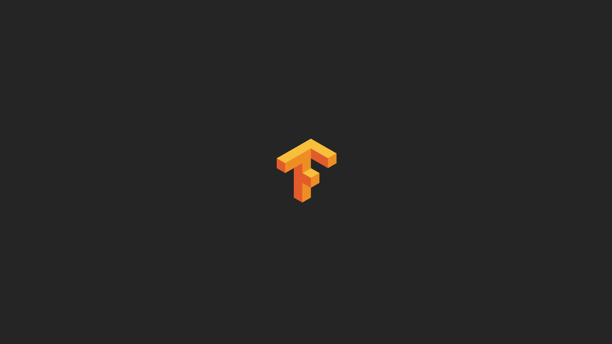
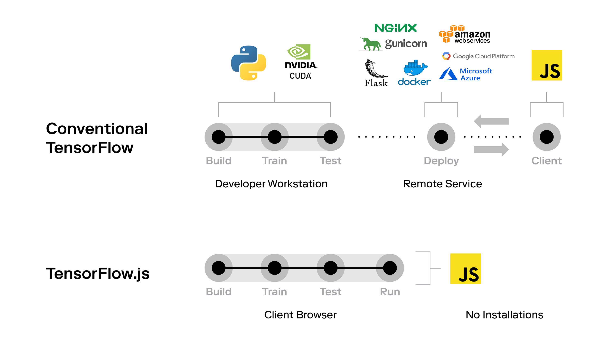
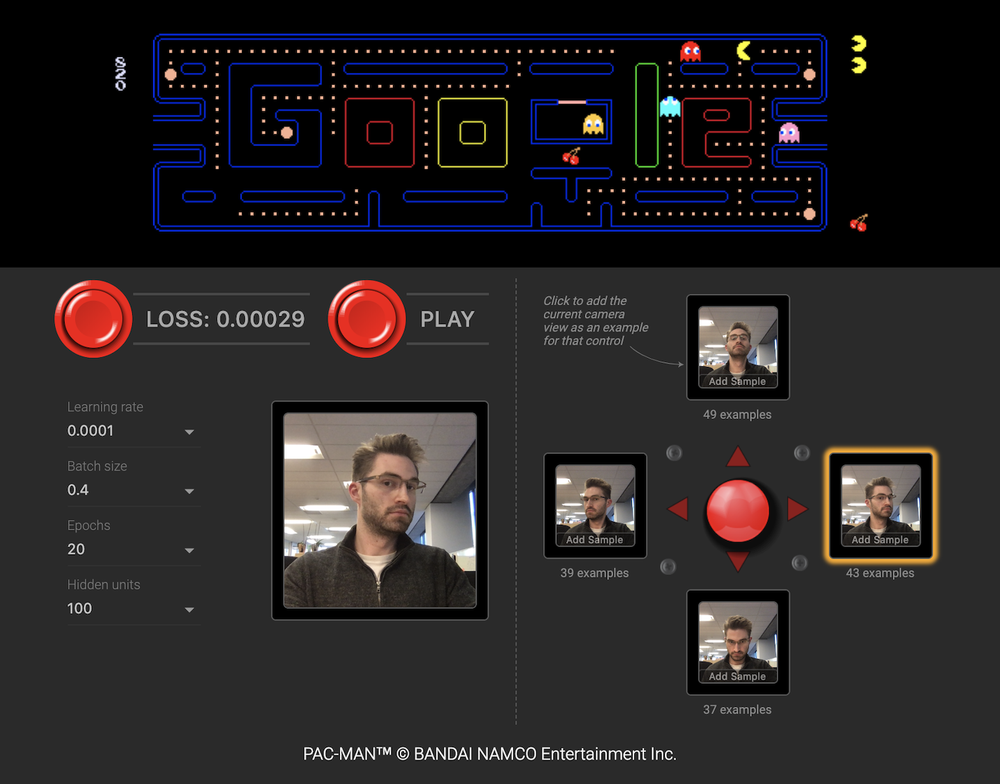

> TensorFlow.js позволяет веб-разработчикам легко создавать и запускать приложения c искусственным интеллектом в браузере, используя только JavaScript.

Вы - веб-разработчик, заинтересовавшийся искусственным интеллектом (AI)? Хотите с легкостью создать приложения AI полностью на JavaScript, которые будут работать где угодно, без головной боли от утомительной установки, размещения на облачных сервисах или работы с Python? Тогда TensorFlow.js для вас!

Эта библиотека смещает парадигму и устраняет разрыв между разработчиками веб-интерфейсов и ранее трудоемким процессом обучения и приручения AI. Теперь разработчики могут с легкостью использовать искусственный интеллект для создания приложений, реагирующих в реальном времени на вводимые пользователем голосовые и мимические данные, или для создания более интеллектуальных приложений, которые учатся на поведении пользователей и адаптируются к ним. AI может создавать новые, *личные* впечатления и автоматизировать утомительные задачи. Примерами могут служить системы рекомендаций, взаимодействие с помощью голосовых команд или жестов, использование камеры мобильного телефона для идентификации продуктов или мест, а также обучение, помогающее пользователю решать повседневные задачи. По мере того, как постоянно ускоряющаяся революция в искусственном интеллекте находит свое применение в интеллектуальных веб-приложениях, это также может стать ценным навыком, чтобы произвести впечатление на вашего начальника или потенциальных работодателей.

В первой части серии мы кратко расскажем о преимуществах TensorFlow.js по сравнению с традиционными подходами с бэкэндом на Python, чтобы продемонстрировать, почему это так важно.

## Искусственный интеллект, освобожденный

В прошлом многие из лучших фреймворков машинного обучения (ML) и глубокого обучения (DL) требовали свободного владения Python и связанной с ним экосистемой библиотек. Эффективное обучение моделей ML требовало использования специального аппаратного и программного обеспечений, таких как графические процессоры NVIDIA и CUDA. На сегодняшний день интеграция ML в приложения JavaScript часто означает развертывание части ML в удаленных облачных сервисах, таких как AWS Sagemaker, и обращение к ней по API. Этот не родной, ориентированный на бэкэнд подход, вероятно, не позволил многим веб-разработчикам воспользоваться преимуществами, предлагаемыми AI для интерфейса.

С TensorFlow.js все не так! Преодолев вышеописанные препятствия, использование AI-решений стало быстрым, легким и увлекательным. Во второй части серии мы покажем, как легко создавать, обучать и тестировать собственные модели ML в браузере, используя только JavaScript!

Теперь вы можете писать код для ML на JavaScript, но действительно круто то, что TensorFlow.js позволяет исполнять его на стороне клиента, что имеет ряд неоспоримых преимуществ.

## Приложением легко делиться

Предоставьте пользователю URL, и, вуаля, он взаимодействует с вашей моделью ML. Это так просто! Модели запускаются прямо в браузере без дополнительных файлов или установок. Вам больше не нужно связывать JavaScript с Python, работающим в облаке. И вместо того, чтобы бороться с виртуальными средами или менеджерами пакетов, все зависимости могут быть добавлены тегами `script` в HTML. Это позволяет эффективно работать в команде, быстро создавать прототипы и безболезненно проверять идеи.

## Вычислительную мощность обеспечивает клиент

Обучение и прогнозирование осуществляется на аппаратном обеспечении пользователя. Это исключает значительные затраты и усилия для разработчика. Вам не нужно беспокоиться о поддержке работы потенциально дорогостоящей удаленной машины и регулировке вычислительной мощности в зависимости от изменения объема использования. Забудьте о балансировке нагрузки, микросервисах, контейнеризации. Исключая подобные требования к серверной инфраструктуре, TensorFlow.js позволяет вам сосредоточиться на создании удивительных пользовательских интерфейсов! Тем не менее, мы все равно должны позаботиться о том, чтобы аппаратное обеспечение клиента было достаточно мощным для обеспечения удовлетворительного опыта, учитывая вычислительные требования наших моделей искусственного интеллекта.

## Данные никогда не покидают устройство клиента!

Это крайне важно, так как пользователи все больше заботятся о защите своей конфиденциальной информации, особенно после массовых скандалов с данными и [нарушений безопасности](https://www.businessinsider.com/data-hacks-breaches-biggest-of-2018-2018-12), таких как [Cambridge Analytica](https://www.nytimes.com/2018/09/28/technology/facebook-hack-data-breach.html). С TensorFlow.js пользователи могут использовать AI, не отправляя свои личные данные по сети и не передавая их третьим лицам. Это облегчает создание безопасных приложений, например, приложений для здравоохранения, которые подключаются к носимым медицинским датчикам. TensorFlow.js также позволяет создавать браузерные AI-расширения для улучшенного или адаптивного взаимодействия с пользователем, сохраняя при этом поведение пользователя приватным. Посмотрите [этот репозиторий](https://github.com/JK0N/tensorflow-image-recognition-chrome-extension) с примером расширения Google Chrome, которое использует TensorFlow.js для распознавания изображений в браузере.

(Вверху) Традиционная архитектура ML включает в себя разнообразные технологии, требующие координации и связи между несколькими приложениями. (Внизу) TensorFlow.js может значительно упростить архитектуру и технологический стек. Все запускается в клиентском браузере с использованием JavaScript.

Архитектура TensorFlow.js может быть еще более упрощена, если доступна [предварительно обученная модель](https://github.com/tensorflow/tfjs-models). В этом случае клиент загружает модель и полностью пропускает обучение. Если необходима дальнейшая специализация модели, можно сэкономить значительные усилия и время обучения, используя расширенное обучение (*трансферное обучение*) на предварительно обученной модели, а не обучение с нуля.

## Легкий доступ к данным датчиков

Прямая интеграция JavaScript облегчает подключение модели к входным устройствам, таким как микрофон или веб-камера. Поскольку на мобильных устройствах работает тот же самый код браузера, вы также можете использовать данные акселерометра, GPS и гироскопа. По состоянию на начало 2019 года обучение на мобильных устройствах остается непростым делом из-за аппаратных ограничений, но оно станет легче в течение следующих нескольких лет, поскольку производители мобильных процессоров начнут интегрировать [оптимизацию вычислений для AI](https://www.pcmag.com/article/359986/mobile-processors-of-2018-the-rise-of-machine-learning-fea) в линейки своих продуктов.

## Очень интерактивный и адаптивный опыт

Вывод в режиме реального времени на стороне клиента позволяет создавать приложения, которые немедленно реагируют на пользовательский ввод, например жесты: Google выпустил игру для веб-камеры, позволяющую пользователю играть в Pacman головой ([попробуйте здесь](https://storage.googleapis.com/tfjs-examples/webcam-transfer-learning/dist/index.html)). Модель обучена связывать движения головы пользователя с конкретными клавишами управления. Приложения также могут обнаруживать и реагировать на человеческие эмоции, предоставляя новые возможности удивлять и радовать. Предварительно обученные модели могут быть загружены и затем настроены в браузере с помощью трансферного обучения, чтобы адаптировать их к конкретным пользователям.

*Изображение из игры Google WebCam Pacman, где ваша голова становится контроллером!*

*Демонстрация предварительно обученной модели [PoseNet](https://github.com/tensorflow/tfjs-models/tree/master/posenet), выполняющую в режиме реального времени оценку основных поз тела.*

**Также TensorFlow.js имеет следующие преимущества:**

## Использование предварительно обученных моделей

Решайте сложные задачи быстро, загружая в браузер мощные предварительно обученные модели. Не нужно изобретать велосипед (*модель*) или начинать с нуля. Выберите среди растущего числа доступных моделей ([по этой ссылке](https://github.com/tensorflow/tfjs-models)) или даже создайте JavaScript-порт модели на Python с помощью этого удобного [преобразователя TensorFlow](https://github.com/tensorflow/tfjs-converter). TensorFlow.js также поддерживает расширенное обучение, позволяя переобучать модели на основе данных датчиков и адаптировать их к конкретному приложению с помощью трансферного обучения. Огромная ценность построения модели поверх предварительно обученных моделей заключается в том, что последние часто обучались на огромных выборках данных и использовали вычислительные ресурсы, обычно недоступные большинству людей, не говоря уже о браузере. Позвольте другим выполнять тяжелую работу, в то время как вы сосредоточитесь на более творческой задаче по подгонке моделей к потребностям вашего пользователя.

## Аппаратное ускорение для всех графических процессоров

TensorFlow.js использует встроенные графические устройства для ускорения обучения модели благодаря использованию WebGL. Вам не нужен графический процессор NVIDIA с установленной CUDA для обучения модели. Это правда, наконец, можно обучать модели глубокого обучения и на графических процессорах AMD!

## Унифицированные бэкэнд и фронтэнд кодовые базы

С поддержкой CUDA TensorFlow.js также работает на Node.js. В этом смысле он расширяет традиционное преимущество JavaScript «писать один раз, работая как на клиенте, так и на сервере», в области искусственного интеллекта.

## Требования

Пара замечаний о том, что нужно учесть перед переходом на полную версию TensorFlow.js. TensorFlow.js может использовать значительно больше ресурсов, чем ваши типичные приложения JavaScript, особенно когда речь идет об изображениях или видео. Например, приложение Webcam Pacman использует приблизительно 100 мегабайт браузерных ресурсов и 200 мегабайт ОЗУ графического процессора при работе в Chrome v71 на MacBook Pro с Mojave v10.14.2.

Для лучшей производительности требуются браузеры с поддержкой WebGL и GPU. Вы можете проверить, поддерживается ли WebGL, перейдя по [этой ссылке](https://get.webgl.org/). Даже с WebGL поддержка графического процессора может быть недоступна на старых устройствах из-за требования обновления видеодрайверов.

Требования к современному оборудованию и обновленному программному обеспечению для достижения оптимальной производительности могут привести к значительному изменению пользовательского опыта на разных устройствах. Поэтому перед выкладкой приложения с TensorFlow.js следует провести всестороннее тестирование производительности на самых разных устройствах, особенно на самых слабых.

Существует несколько стратегий для устранения возможных ограничений производительности. Приложения могут проверять доступные вычислительные возможности и соответственно менять модель с соответствующим компромиссом в точности. Снижение требований к памяти в 5-10 раз часто достигается за счет уменьшения параметров модели без потери точности более чем на 20%. Уменьшение размера модели также поможет сэкономить пропускную способность в тех случаях, когда предварительно обученная модель передается на устройство клиента. Хорошее управление памятью поможет избежать утечек памяти (например, с помощью `tf.tidy()`).

Наконец, ничто не может сравниться с хорошим пониманием данных и проблематикой. Например, многое в распознавании изображений можно решить с помощью изображений с удивительно низким разрешением. Некоторые проблемы также можно упростить, используя обычные алгоритмы с более низкими требованиями к ресурсам или используя пользователя для выполнения части работ, например, центровки обнаруживаемого объекта.

## Примеры

Звучит здорово! Как же приступить? Изучите вторую часть данной серии (*оригинал еще не опубликован, переведем что-нибудь еще по практике этой темы - прим. пер.*), чтобы узнать, как создавать свои собственные приложения TensorFlow.js!

Вот еще несколько забавных примеров, чтобы вы пускали слюни:

* [Давайте потанцуем!](https://rangle-ml-christmas.netlify.com/) Интерактивная анимация на праздничную тему, созданная командой Rangle.io для декабря 2018 года.
* [Emoji Scavenger Hunt](https://emojiscavengerhunt.withgoogle.com/) от Google. Веселая игра, в которой вам нужно искать и фотографировать объекты, выглядящие как смайлики!
* [Teachable Machine](https://teachablemachine.withgoogle.com/) от Google, где вы можете обучить нейронную сеть распознаванию определенных жестов и использовать их для управления выводимыми изображением или звуком.
* [Rock Paper Scissors](https://reiinakano.github.io/tfjs-rock-paper-scissors/) от Reiichiro Nakano - забавный поворот в классической школьной игре.
* [Emotion Extractor](https://brendansudol.com/faces/) от Brendan Sudol, распознающий эмоции по выражению лица в загруженных изображениях и помечающий их соответствующими смайликами.

*Emotion Extractor от Brendan Sudol. Источник: https://brendansudol.com/faces/.*

В дополнение к играм и приложениям TensorFlow.js можно использовать для создания интерактивных инструментов обучения ключевым понятиям в машинном и глубоком обучениях:

* [GAN Lab](https://poloclub.github.io/ganlab/): интерактивная игровая площадка для общих состязательных сетей (GAN) в браузере.
* [GAN Showcase](https://alantian.net/ganshowcase/): любопытная демонстрация GAN от Yingtao Tian, которая создает изображения.
* [tSNE для Интернета](https://nicola17.github.io/tfjs-tsne-demo/): браузерная демонстрация алгоритма tSNE для анализа многомерных данных.
* [Neural Network Playground](http://playground.tensorflow.org/#activation=tanh&batchSize=10&dataset=circle&regDataset=reg-plane&learningRate=0.03&regularizationRate=0&noise=0&networkShape=4,2&seed=0.72987&showTestData=false&discretize=false&percTrainData=50&x=true&y=true&xTimesY=false&xSquared=false&ySquared=false&cosX=false&sinX=false&cosY=false&sinY=false&collectStats=false&problem=classification&initZero=false&hideText=false): хотя технически это не TensorFlow.js, но эта песочница была построена из кода, который в конечном итоге стал TensorFlow.js, и ее можно считать браузерным приложением, с которого все началось!

Чтобы узреть еще больше удивительных проектов, созданных в TensorFlow.js, загляните [сюда](https://github.com/tensorflow/tfjs/blob/master/GALLERY.md)!

