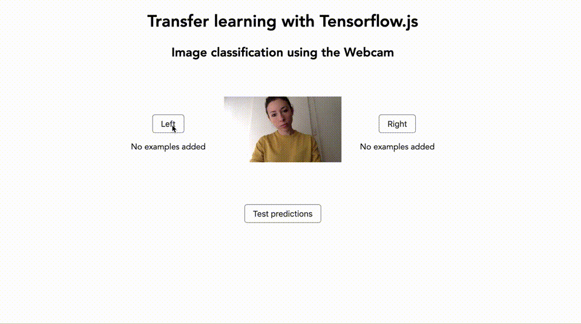

> Краткое резюме: Использование JavaScript и таких фреймворков, как Tensorflow.js, - отличный способ начать работу и узнать больше о машинном обучении. В этой статье Charlie Gerard раскрывает три основных способа использования машинного обучения во фронтенде с помощью Tensorflow.js и проливает свет на их границы.

Часто кажется, что машинное обучение подчиняется сугубо специалистам по анализу данных и разработчикам Python. Однако за последние пару лет были созданы платформы с открытым исходным кодом, делающие машинное обучение более доступным на разных языках программирования, включая JavaScript. В этой статье мы будем использовать Tensorflow.js для изучения различных возможностей использования машинного обучения в браузере и в качестве примеров создадим несколько проектов.

## Что такое машинное обучение?

Прежде чем мы углубимся в код, давайте кратко поговорим о том, что такое машинное обучение, а также о некоторых основных понятиях и терминологии.

## Определение

Наиболее распространенное определение машинного обучения звучит так: машинное обучение - это способность компьютеров учиться на данных без явного программирования.

Если сравнивать машинное обучение с традиционным программированием, то можно сказать, что при машинном обучении мы даем возможность компьютерам идентифицировать определенные паттерны в данных и создавать на их основе прогнозы без необходимости получения точных указаний, что искать.

Давайте рассмотрим пример выявления [фрода](https://ru.wikipedia.org/wiki/%D0%A4%D1%80%D0%BE%D0%B4). Не существует установленных критериев мошеннических операций. Мошенничество может происходить в любой стране, с любым аккаунтов, оно может быть нацелено на любого клиента, в любое время и так далее. Почти невозможно отследить все это вручную.

Однако, используя данные предыдущих мошеннических операций, собранных за годы, мы можем натренировать алгоритм машинного обучения находить паттерны в данных и создать модель, получающую на вход транзакцию и предсказывающую вероятность ее мошеннического характера.

## Основные концепции

Для более простого понимания последующих примеров кода, нам нужно рассмотреть несколько общих терминов.

### Модель

Когда вы тренируете алгоритм машинного обучения с набором данных, модель является результатом этого процесса обучения. Это похоже на функцию, которая принимает входные данные и в качестве выходных данных выдает прогноз.

### Метки и свойства

Метки и свойства относятся к данным, которые вы предоставляете алгоритму в процессе обучения.

Метка - ваша классификация записи в наборе данных. Например, если набор данных представляет собой CSV-файл, описывающий животных, то метками могут быть «кошка», «собака» или, например, «змея».

Свойства, с другой стороны, являются характеристиками записи в наборе данных. В примере с животными это могут быть «усатые, мяукающие», «игривые, лающие», «пресмыкающиеся, ползучие» и так далее.

Используя эти данные, алгоритм машинного обучения сможет найти корреляцию между свойствами и меткой и использовать ее для будущих прогнозов.

### Нейронные сети

Нейронные сети - это набор алгоритмов машинного обучения, пытающихся имитировать работу мозга, используя слои искусственных нейронов.

В данное статье мы не будем подробно останавливаться на том, как они работают, но если вы хотите углубиться, вот [действительно хорошее видео](https://youtu.be/aircAruvnKk).

Теперь, когда мы определились со значением нескольких наиболее распространенных в машинном обучении терминов, давайте поговорим о том, что можно сделать с помощью JavaScript и инфраструктуры Tensorflow.js.

## Способы использования

В настоящее время доступно три способа использования:

* Предварительно обученная модель
* Трансферное обучение
* Создание, запуск и использование собственной модели

Давайте начнем с самого простого.

### Предварительно обученная модель

В зависимости от решаемой проблемы может оказаться, что необходимая модель уже существует и обучена с определенным набором данных. Такую модель можно просто импортировать в свой код.

Например, мы создаем веб-сайт для определения, изображен ли на картинке кот. Популярная модель классификации изображений называется MobileNet и доступна в виде предварительно обученной модели с Tensorflow.js.

Код для сайта будет выглядеть следующим образом:

```html
<html lang="en">
  <head>
    <meta charset="UTF-8">
    <meta name="viewport" content="width=device-width, initial-scale=1.0">
    <meta http-equiv="X-UA-Compatible" content="ie=edge">
    <title>Cat detection</title>
    <script src="https://cdn.jsdelivr.net/npm/@tensorflow/tfjs@1.0.1"> </script>
    <script src="https://cdn.jsdelivr.net/npm/@tensorflow-models/mobilenet@1.0.0"> </script>
  </head>
  <body>
    

    <script>
      const img = document.getElementById('image');

      const predictImage = async () => {
        console.log("Model loading...");
        const model = await mobilenet.load();
        console.log("Model is loaded!")

        const predictions = await model.classify(img);
        console.log('Predictions: ', predictions);
      }
      predictImage();
    </script>
  </body>
</html>
```

Мы начинаем с импорта Tensorflow.js и модели MobileNet в теге `head` нашего HTML:

```html
<script src="https://cdnjs.cloudflare.com/ajax/libs/tensorflow/1.0.1/tf.js"> </script>
<script src="https://cdn.jsdelivr.net/npm/@tensorflow-models/mobilenet@1.0.0"> </script>
```

Затем внутри тега `body` у нас есть элемент изображения, который будет использоваться для прогнозов:

```html

```

И наконец, внутри тега `script` у нас есть JavaScript-код, загружающий предварительно обученную модель MobileNet и классифицирующий изображение, найденное в теге `image`. Он возвращает массив из трех прогнозов, которые упорядочены по степени вероятности (первый элемент - лучший прогноз).

```js
const predictImage = async () => {
  console.log("Model loading...");
  const model = await mobilenet.load();
  console.log("Model is loaded!")
  const predictions = await model.classify(img);
  console.log('Predictions: ', predictions);
}

predictImage();
```

Вот и все! Так вы можете использовать предварительно обученную модель в браузере с Tensorflow.js!

**Примечание.** Если вы хотите узнать, что еще может классифицировать модель MobileNet, вы можете найти [список различных классов](https://github.com/tensorflow/tfjs-examples/blob/master/mobilenet/imagenet_classes.js) на Github.

Важно понимать, что загрузка предварительно обученной модели в браузере может занять некоторое время (иногда до 10 секунд), поэтому вы, вероятно, захотите загрузить модель фоново или специальным образом подготовить интерфейс.

Если вы предпочитаете использовать Tensorflow.js в качестве npm-модуля, вы можете импортировать модуль следующим образом:

```js
import * as mobilenet from '@tensorflow-models/mobilenet';
```

Не стесняйтесь «поиграть» с этим примером на [CodeSandbox](https://codesandbox.io/s/snowy-cherry-3i0z8).

Теперь, когда мы увидели, как использовать предварительно обученную модель, давайте рассмотрим второй способ использования: трансферное обучение.

### Трансферное обучение

Трансферное обучение - это способность комбинировать предварительно обученную модель с пользовательскими данными обучения. Это означает, что вы можете использовать функциональность модели и добавлять свои собственные данные, не создавая все с нуля.

Например, алгоритм был обучен тысячами изображений для создания модели классификации изображений, и вместо того, чтобы создавать очередную модель, трансферное обучение позволяет комбинировать пользовательские данные изображений с предварительно обученной моделью для создания нового классификатора изображений. Эта функция позволяет быстро и легко иметь более индивидуальный классификатор.

Чтобы понять, как это будет выглядеть в коде, давайте переориентируем наш предыдущий пример на классификацию новых изображений.


*[Демо](https://zvs9k.sse.codesandbox.io/)*

Ниже приведены несколько наиболее важных выдержек из кода этого примера, но если вам хочется взглянуть на весь код, вы можете найти его в [CodeSandbox](https://codesandbox.io/s/tfjstransferlearning-zvs9k).

Нам все еще нужно начать с импорта Tensorflow.js и MobileNet, но на этот раз нам также нужно добавить классификатор KNN ([k-ближайших соседей](https://ru.wikipedia.org/wiki/%D0%9C%D0%B5%D1%82%D0%BE%D0%B4_k-%D0%B1%D0%BB%D0%B8%D0%B6%D0%B0%D0%B9%D1%88%D0%B8%D1%85_%D1%81%D0%BE%D1%81%D0%B5%D0%B4%D0%B5%D0%B9)):

```html
<!-- Загрузка TensorFlow.js -->
<script src="https://cdn.jsdelivr.net/npm/@tensorflow/tfjs"></script>
<!-- Загрузка MobileNet -->
<script src="https://cdn.jsdelivr.net/npm/@tensorflow-models/mobilenet"></script>
<!-- Загрузка KNN классификатора -->
<script src="https://cdn.jsdelivr.net/npm/@tensorflow-models/knn-classifier"></script>
```

Причина, по которой нам нужен классификатор, заключается в том, что (вместо того, чтобы использовать только модуль MobileNet) мы добавляем пользовательские образцы, которые модель никогда не встречала. Классификатор KNN позволит нам соединить все вместе и выполнить прогнозы для объединенных данных.

Затем мы можем заменить изображение кота тегом `video`, чтобы использовать изображения с камеры.

```html
<video autoplay id="webcam" width="227" height="227"></video>
```

Наконец, нам нужно добавить на страницу кнопки, которые мы будем использовать в качестве меток для записи образцов видео и запуска прогнозов.

```html
<section>
  <button class="button">Left</button>

  <button class="button">Right</button>

  <button class="test-predictions">Test</button>
</section>
```

Теперь перейдем к файлу JavaScript, в котором мы начнем работу, установив несколько важных переменных:

```js
// Количество классов для классификации
const NUM_CLASSES = 2;
// Метки классов
const classes = ["Left", "Right"];
// Размер веб-камеры. Должен быть 227.
const IMAGE_SIZE = 227;
// Значение K для KNN
const TOPK = 10;

const video = document.getElementById("webcam");
```

В этом конкретном примере мы хотим иметь возможность классифицировать входные данные веб-камеры между наклоном головы влево или вправо, поэтому нам нужны два класса: `left` и `right`.

Размер изображения, установленный на 227, представляет собой размер элемента видео в пикселях. На основе примеров Tensorflow.js это значение должно быть установлено равным 227, чтобы соответствовать формату данных, с которыми была обучена модель MobileNet. Чтобы иметь возможность классифицировать новые данные, они должны соответствовать тому же формату.

> Если вам действительно нужно, чтобы размер был больше, это возможно, но вам придется изменить размер данных, прежде чем передавать их в классификатор KNN.

Затем мы устанавливаем значение K равным 10. Значение K в алгоритме KNN важно, потому что оно представляет количество экземпляров, которые мы учитываем при определении класса нашего ввода.

В этом случае значение 10 означает, что при прогнозировании метки для некоторых новых данных мы будем смотреть на 10 ближайших соседей из обучающих данных, чтобы определить, как классифицировать новый вход.

Наконец, мы получаем элемент видео. Давайте начнем с загрузки модели и классификатора:

```js
async load() {
    const knn = knnClassifier.create();
    const mobilenetModule = await mobilenet.load();
    console.log("model loaded");
}
```

Затем получим доступ к видео-каналу:

```js
navigator.mediaDevices
  .getUserMedia({ video: true, audio: false })
  .then(stream => {
    video.srcObject = stream;
    video.width = IMAGE_SIZE;
    video.height = IMAGE_SIZE;
});
```

После этого давайте настроим некоторые события кнопок для записи образцов данных:

```js
setupButtonEvents() {
    for (let i = 0; i < NUM_CLASSES; i++) {
      let button = document.getElementsByClassName("button")[i];

      button.onmousedown = () => {
        this.training = i;
        this.recordSamples = true;
      };
      button.onmouseup = () => (this.training = -1);
    }
}
```

Давайте напишем функцию, которая будет брать образцы изображений с веб-камеры, форматировать и комбинировать их с модулем MobileNet:

```js
// Получение данных изображения из элемента видео
const image = tf.browser.fromPixels(video);

let logits;
// 'conv_preds' - активация логитов MobileNet.
const infer = () => this.mobilenetModule.infer(image, "conv_preds");

// Тренировка класса, если одна из кнопок нажата
if (this.training != -1) {
  logits = infer();

  // Добавление текущего изображения в классификатор
  this.knn.addExample(logits, this.training);
}
```

И, наконец, собрав несколько изображений с веб-камеры, мы можем проверить прогнозы с помощью следующего кода:

```js
logits = infer();
const res = await this.knn.predictClass(logits, TOPK);
const prediction = classes[res.classIndex];
```

Вы можете избавится от данных веб-камеры, поскольку они нам больше не нужны:

```js
// Избавление от данных после окончания логики
image.dispose();
if (logits != null) {
  logits.dispose();
}
```

Еще раз, если вы хотите взглянуть на полный код, вы можете найти его в [CodeSandbox](https://codesandbox.io/s/tfjstransferlearning-zvs9).

### Создание, запуск и использование собственной модели

Последний способ использования - создать, обучить и запустить модель целиком в браузере. Чтобы проиллюстрировать это, давайте создадим классический пример распознавания ирисов.

Мы создадим нейронную сеть, классифицирующую ирисы по трем категориям (видам): Setosa, Virginica и Versicolor на основе набора данных с открытым исходным кодом.

Прежде чем мы начнем, вот [ссылка на демоверсию](https://ktncm.codesandbox.io/) и вот [CodeSandbox](https://codesandbox.io/s/tfjsall-ktncm), если вы хотите ознакомиться с полным кодом.

В основе каждого проекта машинного обучения лежит набор данных. Одним из первых шагов, которые нужно предпринять, является разделение этого набора данных на тренировочный набор и тестовый набор.

Причина заключается в том, что мы собираемся использовать тренировочный набор для обучения алгоритма, тестовый набор - для проверки точности прогнозов: готова ли модель к использованию или нуждается в доработке.

**Примечание.** Чтобы упростить задачу, я уже разделила тренировочный и тестовый наборы на два файла JSON, которые можно найти в [CodeSanbox](https://codesandbox.io/s/tfjsall-ktncm).

Тренировочный набор содержит 130 элементов, а тестовый - 14. Если вы загляните в данные, вы увидите что-то вроде этого:

```json
{
  "sepal_length": 5.1,
  "sepal_width": 3.5,
  "petal_length": 1.4,
  "petal_width": 0.2,
  "species": "setosa"
}
```

Мы видим четыре различных свойства: длины и ширины чашелистика и лепестка, а также метка вида.

Чтобы иметь возможность использовать эти данные с Tensorflow.js, нам нужно преобразовать их в понятный для него формат. Для тренировочных данных это будет `[130, 4]` (130 выборок с четырьмя свойствами).

```js
import * as trainingSet from "training.json";
import * as testSet from "testing.json";

const trainingData = tf.tensor2d(
  trainingSet.map(item => [
    item.sepal_length,
    item.sepal_width,
    item.petal_length,
    item.petal_width
  ]),
  [130, 4]
);

const testData = tf.tensor2d(
  testSet.map(item => [
    item.sepal_length,
    item.sepal_width,
    item.petal_length,
    item.petal_width
  ]),
  [14, 4]
);
```

Далее также необходимо сформировать выходные данные:

```js
const output = tf.tensor2d(trainingSet.map(item => [
    item.species === 'setosa' ? 1 : 0,
    item.species === 'virginica' ? 1 : 0,
    item.species === 'versicolor' ? 1 : 0

]), [130,3])
```

Затем, раз данные готовы, мы можем перейти к созданию модели:

```js
const model = tf.sequential();

model.add(tf.layers.dense(
    {
        inputShape: 4,
        activation: 'sigmoid',
        units: 10
    }
));

model.add(tf.layers.dense(
    {
        inputShape: 10,
        units: 3,
        activation: 'softmax'
    }
));
```

В приведенном выше примере кода мы создаем экземпляр последовательной модели, добавляем слои ввода и вывода.

Параметры внутри (`inputShape`, `activation` и `units`) выходят за рамки этой статьи, поскольку они могут варьироваться в зависимости от создаваемой модели, типа используемых данных и так далее.

Раз модель готова, мы можем обучить ее данным:

```js
async function train_data(){
    for(let i=0;i<15;i++){
      const res = await model.fit(trainingData, outputData,{epochs: 40});
    }
}

async function main() {
  await train_data();
  model.predict(testSet).print();
}
```

Если все отработает хорошо, вы можете заменить тестовые данные пользовательскими.

Если вызвать функцию `main`, в отладчике отобразится один из трех вариантов:

```js
[1,0,0] // Setosa
[0,1,0] // Virginica
[0,0,1] // Versicolor
```

`predict` возвращает массив из трех чисел, представляющих вероятность принадлежности данных к одному из трех классов. Число, близкое к 1, обладает самой высокой вероятностью.

Например, если выходные данные классификации равны `[0.0002, 0.9494, 0.0503]`, второй элемент массива обладает самой высокой вероятностью, поэтому модель предсказывает, что входные данные соответствуют `Virginica`.

На этом простая нейронная сеть на Tensorflow.js готова!

Мы поговорили только о небольшом наборе данных ирисов, но если вы хотите перейти к более крупным наборам данных или работать с изображениями, шаги останутся теми же:

* Сбор данных
* Разделение данных на тренировочные и тестовые
* Преобразование данных, чтобы Tensorflow.js мог их понять
* Выбор алгоритма
* Обучение
* Предсказание

Если вы хотите сохранить созданную модель, чтобы иметь возможность загрузить ее в другое приложение, вы можете сделать это с помощью следующей строки:

```js
await model.save('file:///path/to/my-model'); // в Node.js
```

**Примечание.** Дополнительную информацию о том, как сохранить модель, можно найти на [этом ресурсе](https://www.tensorflow.org/js/guide/save_load).

## Ограничения

Вот и все! Мы только что обсудили три основных способа использования Tensorflow.js!

Прежде чем мы закончим, я думаю, важно кратко упомянуть некоторые ограничения использования машинного обучения в веб-интерфейсе.

### Производительность

Импорт предварительно обученной модели из внешнего источника может повлиять на производительность приложения. Например, некоторые модели обнаружения объектов занимают более 10 мегабайт, что значительно замедляет работу сайта. Обязательно подумайте о пользовательском опыте и оптимизируйте загрузку зависимостей, чтобы улучшить производительность.

### Качество входных данных

Если вы строите модель с нуля, вам придется собирать собственные данные или находить наборы данных с открытым исходным кодом.

Прежде чем выполнять какую-либо обработку данных или пробовать различные алгоритмы, обязательно проверьте качество входных данных. Например, если вы пытаетесь построить модель анализа настроений для распознавания эмоций в тексте, убедитесь, что данные, которые вы используете для обучения модели, точны и разнообразны. Если качество используемых данных низкое, результаты обучения будут бесполезны.

### Ответственность

Использование предварительно обученной модели с открытым исходным кодом может быть очень быстрым и легким. Однако это также означает, что вы не всегда знаете, как она была сгенерирована, каков был набор данных или даже какой алгоритм использовался. Некоторые модели называются «черными ящиками», а это означает, что вы на самом деле не знаете, как они предсказывали определенный результат.

В зависимости от того, какую проблему вы пытаетесь решить, это может оказаться проблемой. Например, если вы используете модель машинного обучения, чтобы определить вероятность рака на основе отсканированных изображений, в случае ложного отрицания (модель предсказала, что у человека не было рака, когда в действительности он был), за это может последовать реальная юридическая ответственность, и вы должны быть в состоянии объяснить, почему модель сделала тот или иной прогноз.

## Заключение

Использование JavaScript и таких фреймворков, как Tensorflow.js, - отличный способ начать работу и узнать больше о машинном обучении. Несмотря на то, что конечное приложение, вероятно, должно быть построено на языке, подобном Python, JavaScript делает машинное обучение действительно доступным для разработчиков, чтобы «поиграть» с различными функциями и лучше понять фундаментальные концепции, прежде чем тратить время на изучение другого языка.

В этой статье мы рассмотрели только то, что было возможно с помощью Tensorflow.js, однако экосистема других библиотек и инструментов растет. Также доступны более узконаправленные фреймворки, позволяющие изучать использование машинного обучения в других доменах, таких как музыка, с помощью [Magenta.js](https://github.com/tensorflow/magenta-js), или прогнозировать навигацию пользователей по сайту с помощью [guess.js](https://github.com/guess-js/guess)!

По мере того, как производительность инструментов растет, возможности создания приложений с поддержкой машинного обучения в JavaScript, вероятно, будут становиться все более и более захватывающими, и сейчас самое время узнать об этом больше, поскольку сообщество прилагает массу усилий, чтобы сделать машинное обучение доступней.

## Дополнительная информация

Если вы заинтересованы в получении дополнительной информации, вы сможете отыскать ссылки на нее ниже.

### Другие фреймворки и инструменты

* [ml5.js](https://github.com/ml5js/ml5-library)
* [ml.js](https://github.com/mljs)
* [brain.js](https://github.com/BrainJS/brain.js)
* [Keras.js](https://github.com/transcranial/keras-js)
* [PoseNet](https://github.com/tensorflow/tfjs-models/tree/master/posenet)
* [Tensorflow playground](https://playground.tensorflow.org/)

### Примеры, модели, наборы данных

* [Tensorflow.js модели](https://github.com/tensorflow/tfjs-models)
* [Tensorflow.js примеры](https://github.com/tensorflow/tfjs-examples/blob/master/mobilenet/imagenet_classes.js)
* [Наборы данных](https://github.com/tensorflow/datasets/blob/master/docs/datasets.md)

### Вдохновение

* [Teachable machine](https://github.com/googlecreativelab/teachable-machine)
* [Эксперименты с искусственным интеллектом](https://experiments.withgoogle.com/collection/ai)
* [AIJS.rocks](http://aijs.rocks/)
* [Creatability](https://experiments.withgoogle.com/collection/creatability)

Спасибо за прочтение!
