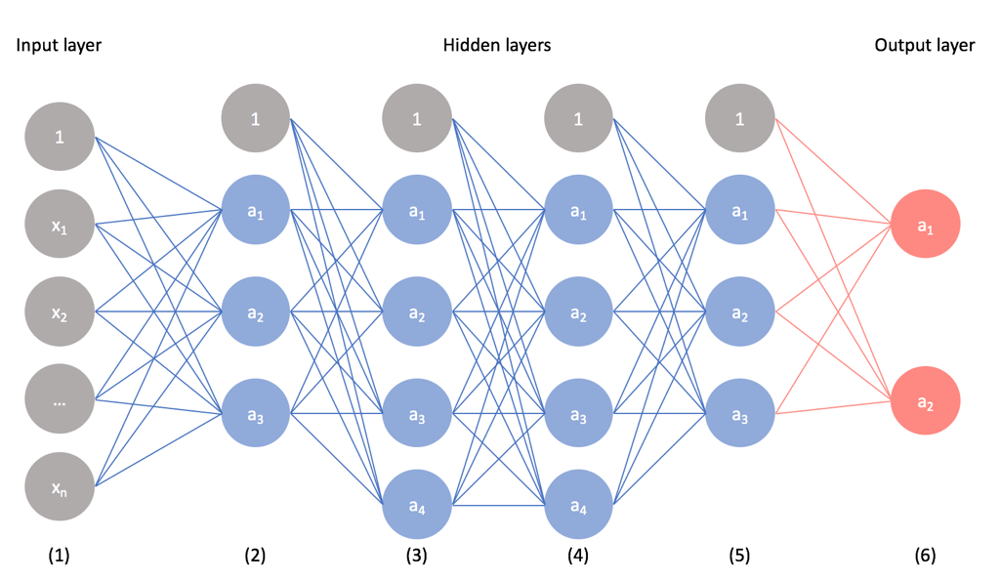
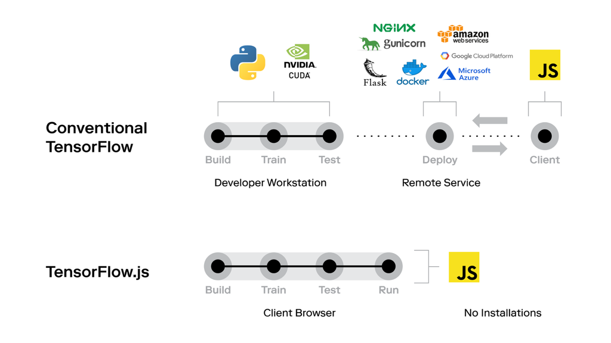

> Примерная расшифровка мини-доклада «Машины учатся. Не бойся, возглавь!» с [HolyJS 2019 Moscow (Lightning talks)](https://holyjs-moscow.ru). Лучше всего все равно посмотреть [видео](https://youtu.be/8OkhauJfTRI), а еще есть [слайды](https://www.icloud.com/keynote/0p5KDGimWhZJBd1bf63HS4Uew#machines-learning%2C_react).

Привет! Меня зовут [Роман Пономарев](https://twitter.com/maksUgr). Ближайшие минуты мы поговорим о машинном обучении и как фронтендер может погрузиться в него уже сейчас.

В начале давайте разберемся с самыми верхнеуровневыми понятиями и их соотношении. *Искусственный интеллект* - это способность машин учиться и думать, как люди. *Машинное обучение* - подотрасль искусственного интеллекта, базирующаяся на алгоритмах, способных обучаться без непосредственного программирования. Наиболее популярный термин - *глубокое обучение* - подмножество машинного обучения, в котором искусственные нейронные сети адаптируются и учатся на больших объемах данных подобно нейронным сетями в нашем мозге.

За примерами применения машинного обучения далеко ходить не нужно: оно окружает нас повсюду в повседневной жизни. Это голосовые помощники в телефонах, антиспам в почте, фродмашины, рекомендации в социальных и датинг сетях, автономные автомобили и даже искусство. Машинное обучение проникло в огромное множество сфер нашей жизни и нет сферы, куда оно не проникнет в будущем.

Под капотом всех этих продуктов в связке работает множество видов алгоритмов машинного обучения и сейчас вы можете видеть лишь часть из них, связанных только с нейронными сетями.

Однако, если говорить о нейронных сетях, то логика их работы всегда примерно одинакова: слои для входящих данных, скрытые слои для работы с этими данными и слои выхода. Очень похоже на обычные чистые функции. Основная задача здесь: написать, обучить и правильно расположить скрытые слои.

Для обучения нейронной сети можно использовать CPU (наиболее медленный способ), GPU (быстрее и часто основной) и TPU - тензорный процессор от Google, показывающий наилучшие результаты в обучении нейронных сетей.

В языках, используемых для создания алгоритмов машинного обучения, по-прежнему держит первенство Python благодаря своей отличной стандартной библиотеке. JavaScript существует среди отстающих, но он динамично развивается и у него большой потенциал: это единственный язык программирования для браузера, а браузер - наше всё.

Наиболее популярной библиотекой машинного обучения в браузере является [TensorFlow.js](https://www.tensorflow.org/js) - порт в JavaScript едва ли не самой важной библиотеки в мире машинного обучения.

Давайте посмотрим как выглядит стандартная разработка и использование машинного обучения для веб-приложения: на Python пишется сеть, обучается и деплоится с использованием всеми нами любимых инструментов. JavaScript здесь только для того, чтобы дергать ручки бэкенда: на нем никакого машинного обучения не происходит. C использованием TensorFlow.js абсолютно все происходит на клиенте, не требуется никакого деплоя (только доставить стандартным способом наш скрипт в браузер). Удобно.

Эта концепция не меняется, если мы будем использовать не TensorFlow.js, а другие JavaScript-библиотеки: [BrainJS](https://github.com/BrainJS), [Face-API](https://github.com/justadudewhohacks/face-api.js/). Также может оказаться полезен [Math.js](https://mathjs.org/) как замена [NumPy](https://numpy.org/) в мире JavaScript.

Безусловно, есть готовые решения, предоставляющие JavaScript-библиотеки для взаимодействия с облаками, например [Yandex SpeechKit](https://cloud.yandex.ru/services/speechkit) или [Dialogflow](https://dialogflow.com/) от Google для распознавания речи и текста.

Важно понимать, что если мы будем обучать нашу сеть во время сессии пользователя, то нам не хватит объема данных и это будет очень долго. Здесь помогает так называемый [Transfer learning](https://en.wikipedia.org/wiki/Transfer_learning), когда мы предобучаем сеть на большом массиве данных и в таком виде поставляем ее в браузер, а уже в рантайме дообучаем ее данными конкретного пользователя и выдаем ему результат, специфичный для него. Минус только в большом весе предобученной модели.

У машинного обучения в браузере есть достаточно много плюсов. Обученными и предобученными сетями легко делиться: это просто очередной скрипт, загружаемый в браузер. Очень круто, что данные не покидают браузер, что очень важно с точки зрения приватности и в каких-то случаях единственно возможный вариант ее достичь. В связи с переносом машинного обучения на клиент уходит сложный деплой, а вычисления переносятся на клиент. Сети будут доступны все датчики, которые мы можем использовать без каких либо задержек, так как мы не ходим ними.

Можно привести различные симпатичные примеры. Например, Pacman в браузере с использованием вашего тела в качестве контроллера. Здесь используется предобученная сеть, которую вы быстро дообучаете своими движениями вперед, назад, влево, вправо. Также существуют другие различные веселости с вебкамерой: определение положения тела и выдача информации о человеке по лицу.

Однако зачем это мне, фронтендеру? Будущее наступает, машинное обучение уже проникло в очень многие сферы и стоит профессионально готовиться к тому, чтобы работать с ним. В Китае, например, знания в области искусственного интеллекта уже спрашивают на собеседованиях и речь не только об IT-сотрудниках. Также машинное обучение открывает множество новых бизнес-сценариев. Погружение в эту тему позволит вам расширить ваш опыт разработчика, выйти за скоуп своих стандартных задач в коде и в целом развлечь вас (почему бы и нет?). Также можно стать первопроходцем, перенести библиотеки с Python на JavaScript, написать свои - поле еще не паханное. А всё, что может быть написано на JavaScript, как мы знаем, рано или поздно будет на нем написано.
