Что мы сделаем? Мы попытаемся создать простую нейронную сеть, которую обучим что-нибудь идентифицировать. Практически не будет никакой истории или математики (по-крайне мере, тонн этого материала). Вместо этого я постараюсь (и, возможно, не смогу) дать вам объяснение рисунками и кодом. Давайте начнем.

Многие термины нейронной сети происходят и обретают смысл с биологической точки зрения, поэтому начнем с самого начала:

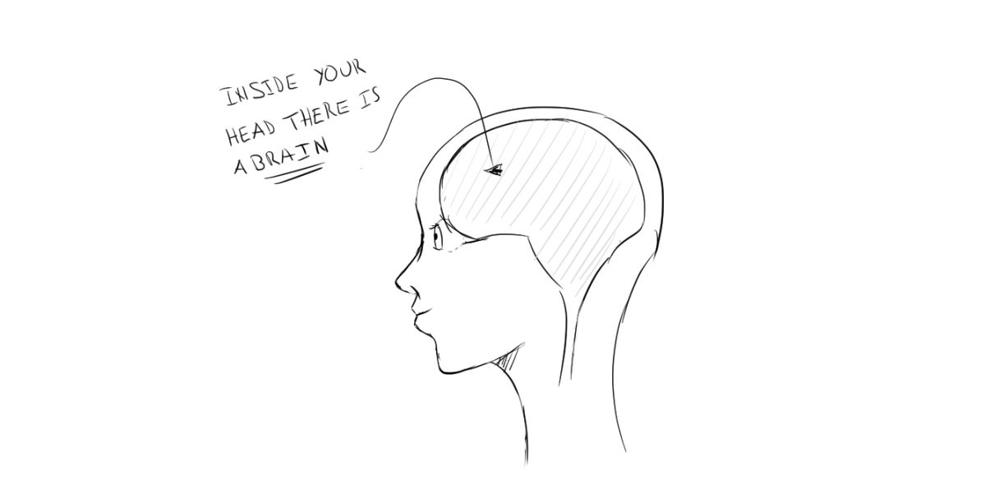

Мозг сложен, но в целом его можно разделить на несколько основных частей и **операций**:

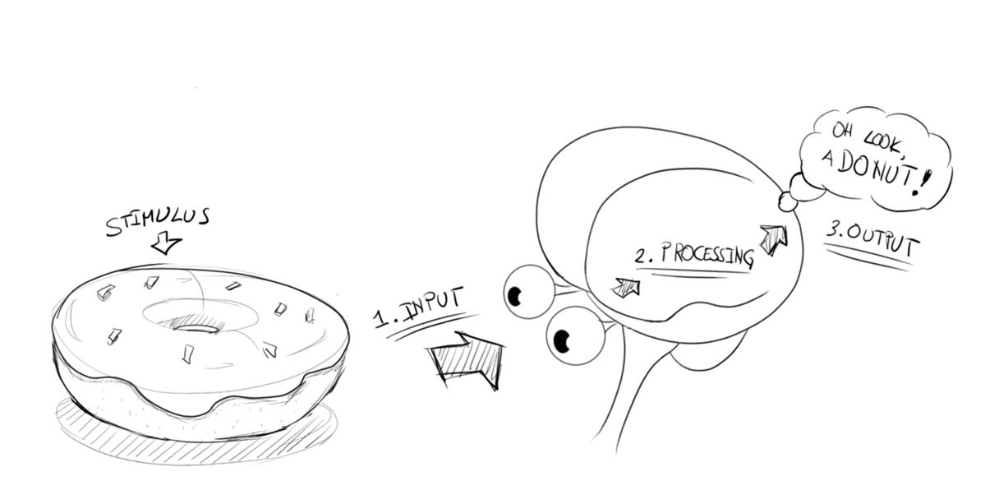

Стимулы также могут быть внутренними (например, восприятие или идея):

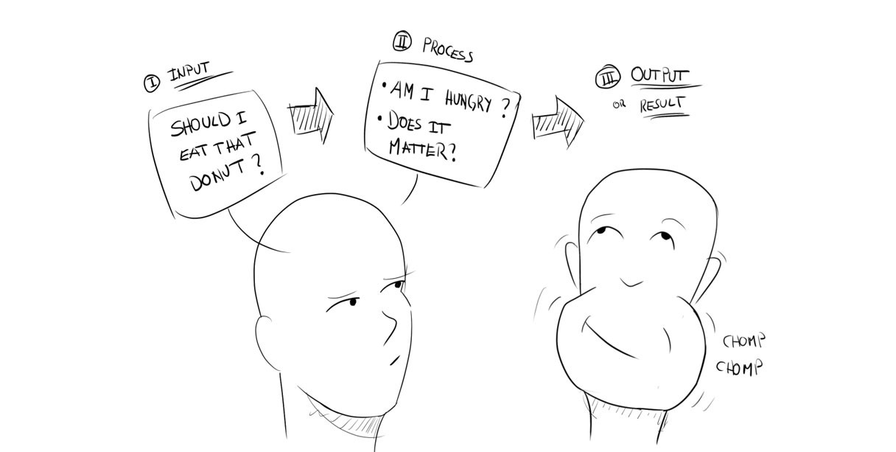

Давайте упрощенно рассмотрим некоторые основные части мозга:

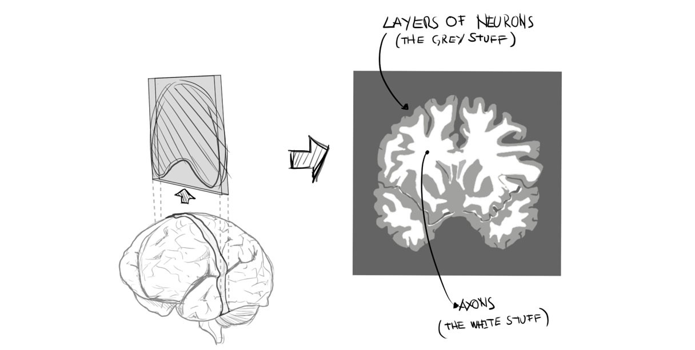
*Мозг на удивление похож на сеть*

**Нейрон** - основная единица вычислений в мозге, он получает и интегрирует химические сигналы от других нейронов и в зависимости от ряда факторов он либо ничего не делает, либо генерирует электрический сигнал (*потенциал действия*), который в свою очередь сигнализирует другим **подключенным** нейронам по средствам синапсов:

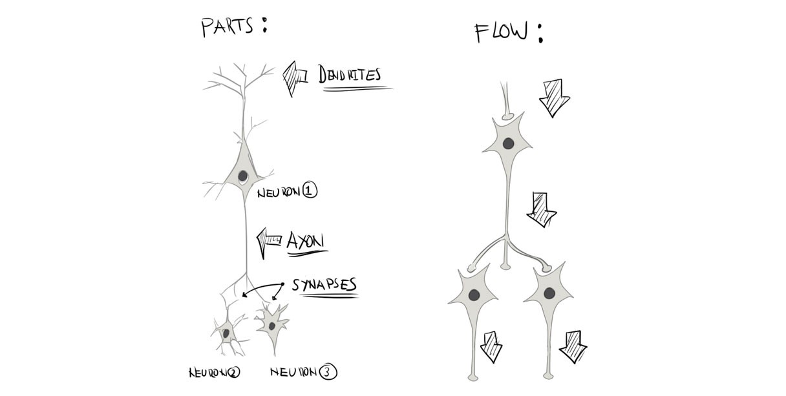

Мечты, воспоминания, идеи, произвольные движения, рефлексы и все, что вы думаете или делаете, генерируется в результате этого процесса: миллионы, может быть, даже миллиарды нейронов, которые запускаются в разной последовательности и создают параллельные подсистемы - биологическую **нейронную сеть**.

Это, конечно, и обобщение, и упрощение, но теперь мы можем описать простую биологическую нейронную сеть:

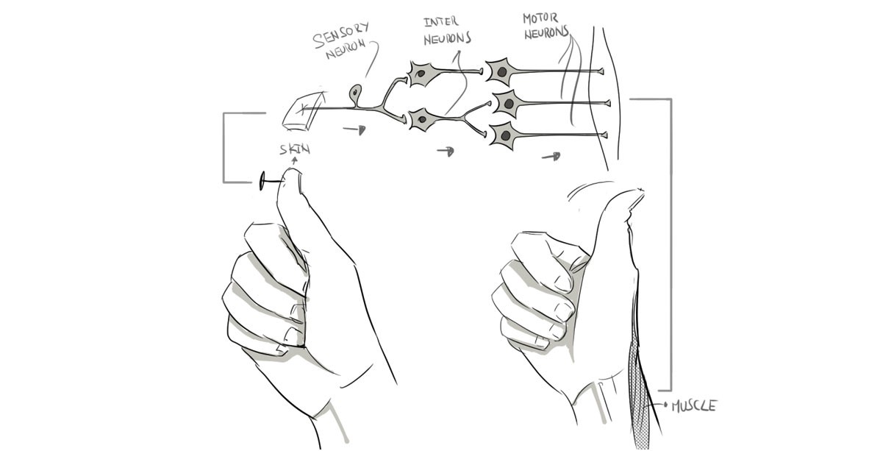

Формальное описание с помощью **графов**:

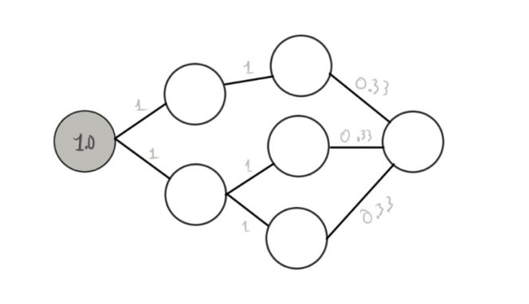

Небольшое дополнение. Круги - нейроны, а линии между ними - **связи**. Для простоты на данном этапе, связи представляют собой **поступательное** движение информации слева направо. Первый нейрон активен и потому заштрихован. Ему также присваивается номер (**1**, когда он активен, и **0**, когда нет). Числа между нейронами указывают **вес** связи.

Выше представлен лишь определенный момент времени работы сети, для более точного отображения необходимо выделять временные сегменты:

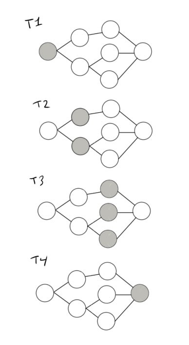

Перед созданием собственной нейронной сети, мы должны понять, как вес влияет на нейроны и как происходит их обучение. Начнем с кролика и эксперимента на условные рефлексы.


Будучи подвергнутыми безвредному дуновению воздуха, кролики, подобно людям, обычно моргают:

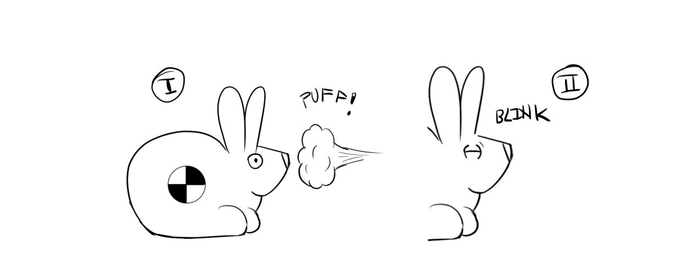

Мы можем смоделировать это поведение с помощью графов:

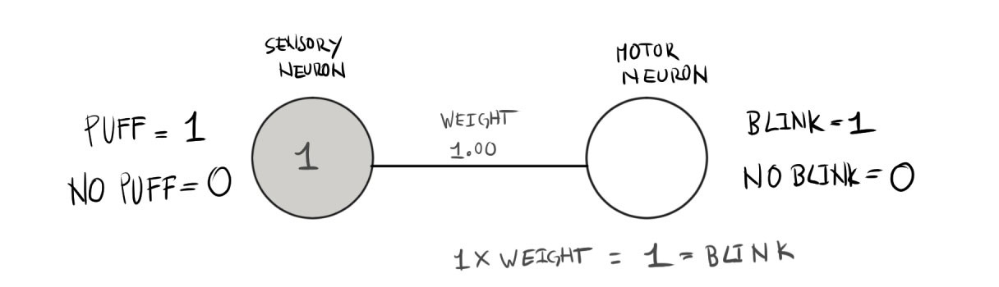

Как и в предыдущем случае, изображение отображает только момент, когда кролик ощущает поток воздуха, поэтому мы **кодируем** его в логическое значение (*булин*). Кроме того, теперь мы можем рассчитать, сработает ли второй нейрон или нет, основываясь на значении веса: если вес равен 1, сенсорный нейрон срабатывает, кролик моргает; если вес ниже 1, сенсорный нейрон не срабатывает, кролик не моргает, так как у второго нейрона есть **ограничение** - 1.

Давайте представим еще один элемент - безобидный звуковой сигнал:

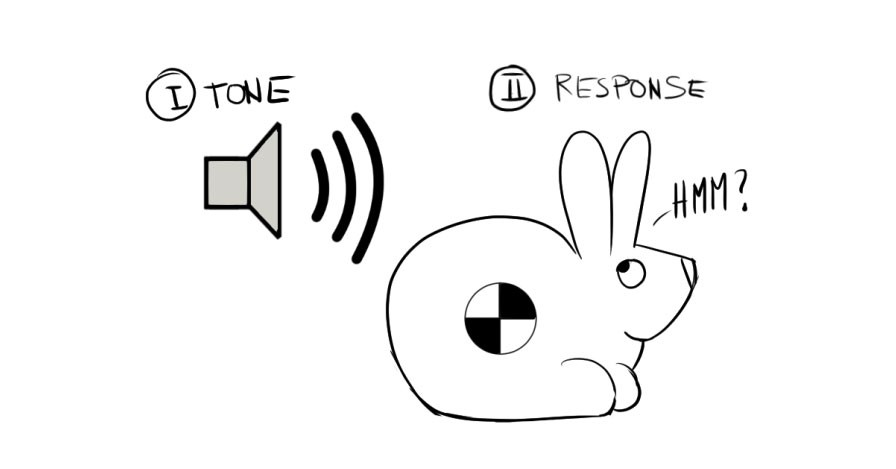

Мы можем смоделировать отсутствие интереса кролика следующим образом:

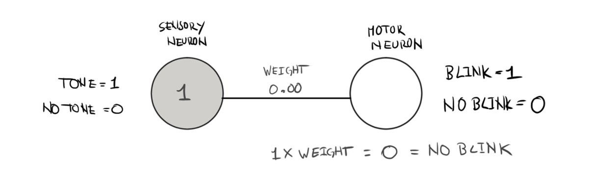

Единственное отличие состоит в том, что вес теперь равен **нулю**, поэтому кролик не моргнет (по крайней мере пока). Давайте научим кролика моргать по команде, смешивая стимулы (звуковой сигнал и поток воздуха):

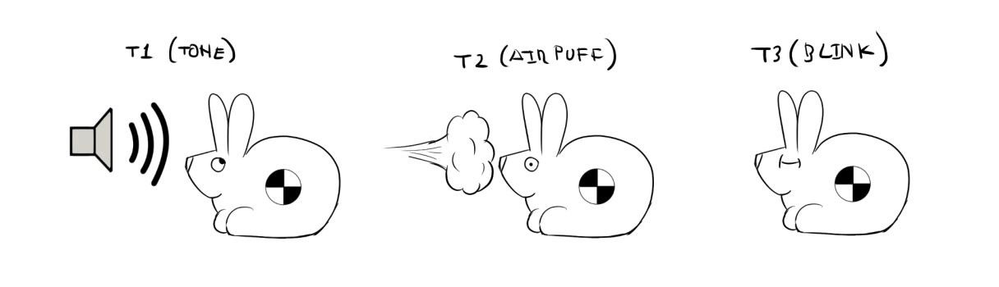

Важно отметить, что каждое из этих событий происходит в разное время. Графы выглядят так:

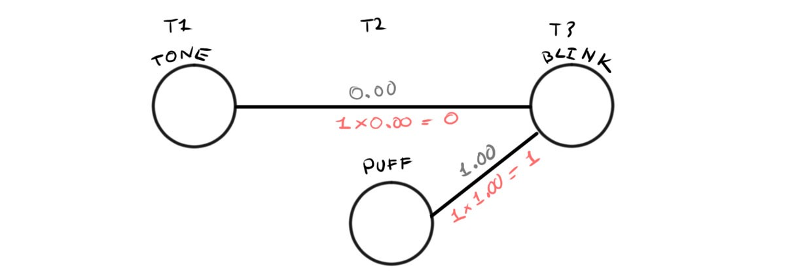

Звуковой сигнал никак не влияет, но поток воздуха все еще вызывает моргание. Мы указываем это через веса, умноженные на стимулы (выделено красным).

**Обучение** сложному поведению можно выразить как постепенное изменение веса между нейронами во времени.

Чтобы обучить кролика, нам нужно повторять процесс:

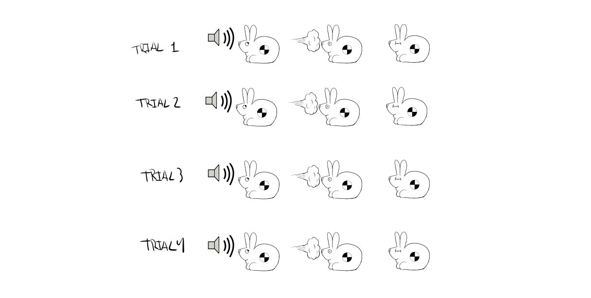

Графы первых трех повторений и начального состояния выглядят следующим образом:

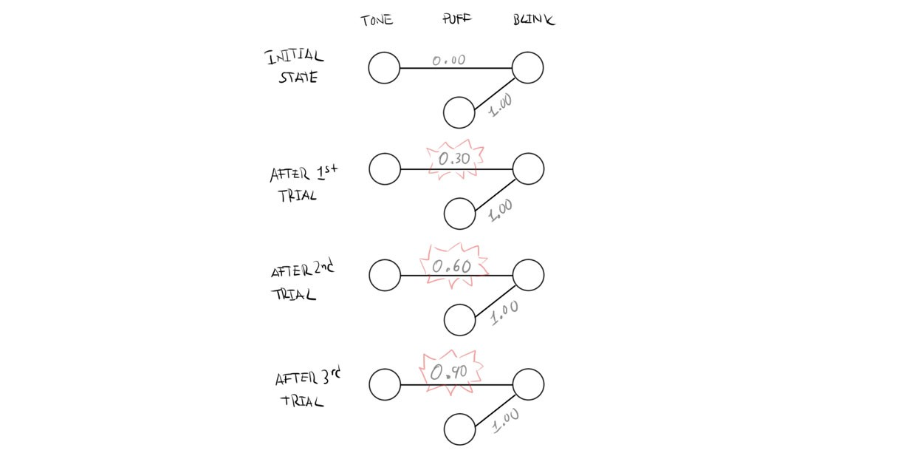

Обратите внимание, что веса для звукового сигнала повышаются после каждого испытания (выделено красным). Их значения на данном этапе произвольны. Я выбрал 0.30, но числа могут быть любыми, даже отрицательными. До третьего повторения у нас было одно и тоже поведение, но после четвертого происходит что-то удивительное… новое поведение.

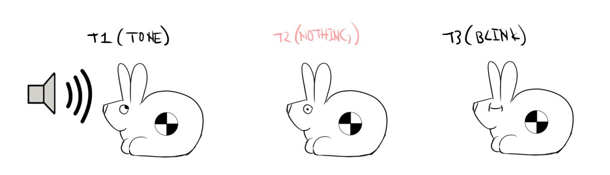

Мы удалили слой воздушного потока, но кролик моргает, услышав звуковой сигнал! Объяснение этому поведению можно найти в здесь:

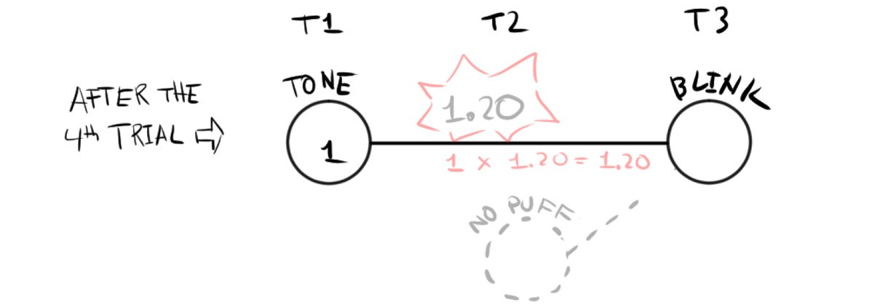

Теперь мы научили кролика распознавать звуковой сигнал и моргать.


*Для достижения результата в условиях настоящего эксперимента может потребоваться около 60 повторений в течение нескольких недель.*

Теперь мы покидаем биологический мир мозгов и кроликов и адаптируем наши знания для создания *искусственной нейронной сети*. Прежде всего мы обозначим простую проблему.

---

Допустим, есть четырехкнопочный автомат, вознаграждающий вас едой, если вы нажмете верную кнопку. Проблема - найти эту кнопку.

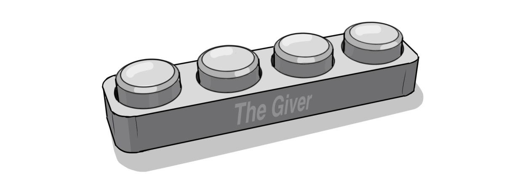

Графически мы можем обозначить нажатую кнопку следующим образом:

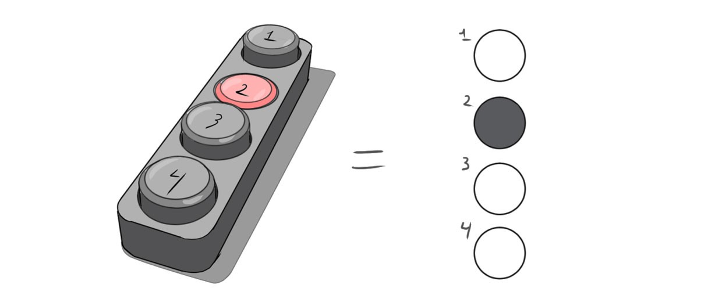

Эту проблему легко разобрать во всей ее полноте, поэтому давайте посмотрим на все возможные варианты, включая решение:

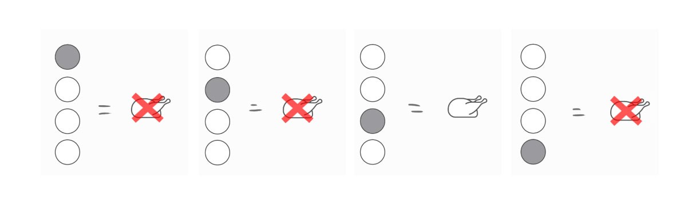
*Хотите курочку на ужин? Нажмите 3.*

Чтобы запрограммировать нейронную сеть, в начале нам нужна модель или граф, с которым мы можем ее сопоставить. Ниже одна из таких схем, которая слабо эмулирует ее биологический аналог:

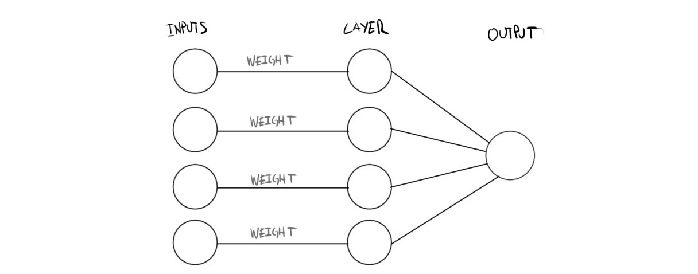

Нейронная сеть получает входные данные, которые в данному случае будут **восприятием** того, какая кнопка была нажата, изменяет их весом и, наконец, возвращает выходные данные на основе добавления слоя. Это звучит немного сложно, поэтому давайте посмотрим, как модель будет отображать нажатие кнопки:

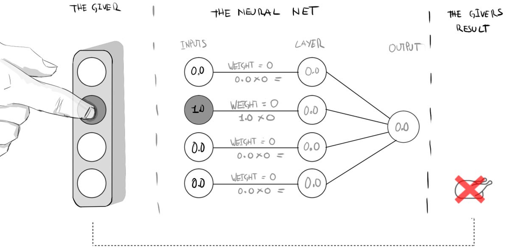
*Обратите внимание, что все веса равны нулю, нейронная сеть пуста, словно младенец, но полностью активна.*

Таким образом, мы переносим внешнее событие на входной слой нейронной сети и вычисляем выходные данные. Они могут совпадать или не совпадать с действительностью, но сейчас мы опустим этот момент и начнем описывать проблему дружественным компьютеру способом.

Давайте начнем с входных данных и весов (я буду использовать JavaScript):

```javascript
var inputs = [0,1,0,0];
var weights = [0,0,0,0];
// для удобства мы можем называть их векторами
```

Следующий шаг - создание функции, принимающей входные данные и веса и вычисляющей выходные данные. Вот она:

```javascript
function evaluateNeuralNetwork(inputVector, weightVector){
  var result = 0;
  inputVector.forEach(function(inputValue, weightIndex) {
    layerValue = inputValue * weightVector[weightIndex];
    result += layerValue;
  });
  return (result.toFixed(2));
}
// может показаться сложным, но здесь происходит лишь умножение пар входные данные / вес и добавление к результату
```

Как и ожидалось, если мы запустим вышеупомянутый код с данными, мы получим тот же результат, что и модель, и граф.

```javascript
evaluateNeuralNetwork(inputs, weights); // 0.00
```

Живой пример: [Neural Net 001](http://codepen.io/k3no/pen/GWyJgP)

---

Следующим шагом и обновлением нашей нейронной сети будет добавление способа проверить свои выходные данные, то есть проверить результат на соответствие реальности. Давайте сначала закодируем эту реальность в переменную:


Чтобы обнаружить несоответствия (и их размер), добавим функцию ошибки:

```
Error = Reality - Neural Net Output
```

Теперь мы можем проверить нейронную сеть:

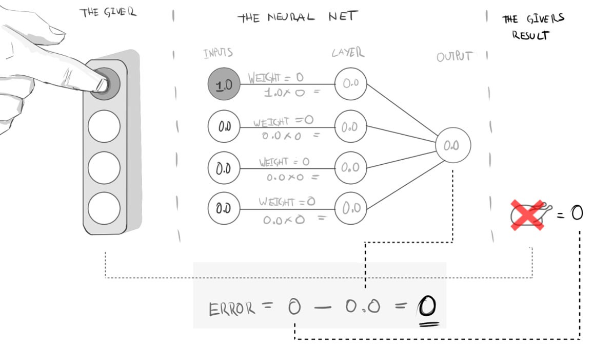

И, что еще более важно, проверить положительный ответ реальности:

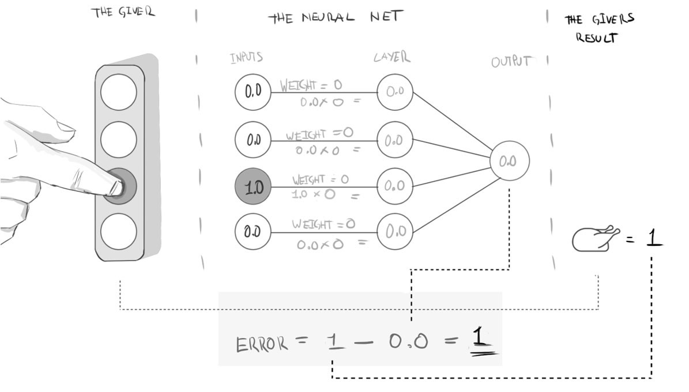

Так что теперь мы точно знаем, что модель нейронной сети **не работает** (и каков размер несоответствий), отлично! Это здорово, потому что теперь мы можем использовать эту ошибку, чтобы направить обучение. Все станет немного точнее, если мы переопределим функцию ошибки следующим образом:

```
Error = Desired Output - Neural Net Output
```

Тонкое, но важное различие, подразумевающее, что мы будем использовать ранее наблюдаемые результаты для сопоставления с будущими (*и обучения, как мы скоро увидим*). Это также работает и в реальной жизни, потому что реальность полна повторяющихся шаблонов и примерно в этом русле работает даже эволюция.

Дальнейшее изменение кода заключается в добавлении новой переменной:

```javascript
var input = [0,0,1,0];
var weights = [0,0,0,0];
var desiredResult = 1;
```

И новой функции:

```javascript
function evaluateNeuralNetError(desired,actual) {
  return (desired — actual);
}
// после исполнения функций нейронной сети и ошибки мы получим:
// "Neural Net output: 0.00 Error: 1"
```

Живой пример: [Neural Net 002](http://codepen.io/k3no/pen/dvaGpX)

---

**Промежуточный итог**: мы начали с проблемы, сделали ее простую модель в виде биологической сети нейронов, затем у нас появился способ сравнить эффективность модели с реальностью или желаемым результатом. Сейчас нам нужен способ исправления возможных несоответствий - процесс, который и для компьютеров, и для людей может называться **обучением**.

---

**Так как же обучить нейронную сеть?**

Основой обучения как для биологических сетей, так и для искусственных, являются **повторение** и **алгоритм обучения**. Мы рассмотрим каждый из них по отдельности. Давайте начнем с алгоритма обучения.

В природе алгоритм обучения можно рассматривать как изменение физических и химических характеристик нейронов под воздействием опыта:

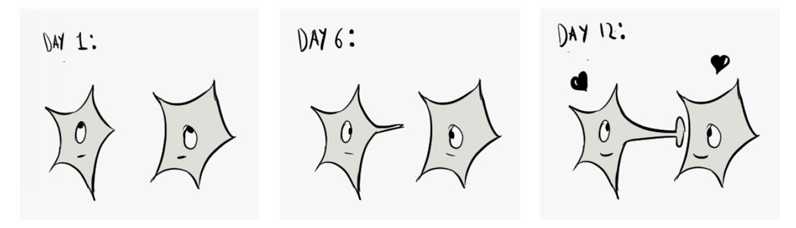
*Сценка двух нейронов, меняющихся со временем*

И в коде, и в модели алгоритм обучения означает, что со временем мы будем что-то менять. Чтобы сделать нашу жизнь проще, давайте добавим переменную, отражающую, насколько:

```javascript
var learningRate = 0.20;
// чем больше темп, тем быстрее учимся : )
```

**И что мы будем менять?**

Мы будем менять веса (*так же, как это делает кролик!*). В частности, веса результата, который мы хотим получить:

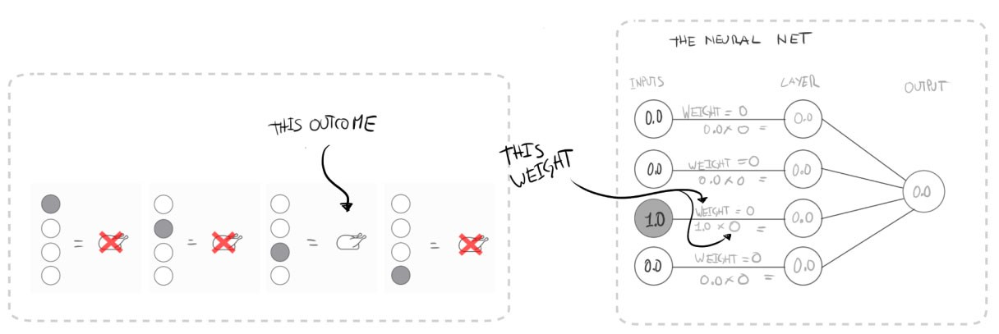

Способ реализации в коде - дело вкуса. Для простоты я добавлю скорость обучения к весу, вот так:

```javascript
function learn(inputVector, weightVector) {
  weightVector.forEach(function(weight, index, weights) {
   if (inputVector[index] > 0) {
    weights[index] = weight + learningRate;
   }
  });
}
```

При вызове функция обучения добавит скорость обучения к вектору веса активного нейрона. Это вывод результата до и после обучения:

```javascript
// Оригинальный вектор весов: [0,0,0,0]
// Результат нейронной сети: 0.00 Error: 1
learn(input, weights);
// Новый вектор весов: [0,0.20,0,0]
// Результат нейронной сети: 0.20 Error: 0.8
// Если это не очевидно, результат нейронной сети стал ближе к 1
// (ужин с курочкой) - это то, чего мы и хотим достигнуть
```

Живой пример: [Neural Net 003](http://codepen.io/k3no/pen/qrJoXO)

Итак, теперь, когда мы движемся в правильном направлении, последняя часть - повторение.

В этом нет ничего особенного, в природе мы просто делаем вещи снова и снова. В коде мы определяем череду повторений:

```javascript
var trials = 6;
```

Далее применим функцию обучения к нейронной сети то количество раз, которое определено в переменной:

```javascript
function train(trials) {
 for (i = 0; i < trials; i++) {
  neuralNetResult = evaluateNeuralNetwork(input, weights);
  learn(input, weights);
 }
}
```

Вот заключительный вывод нашей сети:

```
Neural Net output: 0.00 Error: 1.00 Weight Vector: [0,0,0,0]
Neural Net output: 0.20 Error: 0.80 Weight Vector: [0,0,0.2,0]
Neural Net output: 0.40 Error: 0.60 Weight Vector: [0,0,0.4,0]
Neural Net output: 0.60 Error: 0.40 Weight Vector: [0,0,0.6,0]
Neural Net output: 0.80 Error: 0.20 Weight Vector: [0,0,0.8,0]
Neural Net output: 1.00 Error: 0.00 Weight Vector: [0,0,1,0]
// ужин с курочкой!
```

Живой пример: [Neural Net 004](http://codepen.io/k3no/pen/dvBZLe?editors=0012)

Теперь у нас есть вектор весов, который будет отдавать результат 1 (ужин с курочкой), только если входной вектор соответствует реальности (нажатие третьей кнопки).

**Так что же хорошего в том, что мы только что сделали?**

В нашем конкретном случае нейронная сеть (после обучения) может различать входные данные и сообщать, какие из них приводят к желаемому результату (но нам все равно нужно писать код для конкретной ситуации):

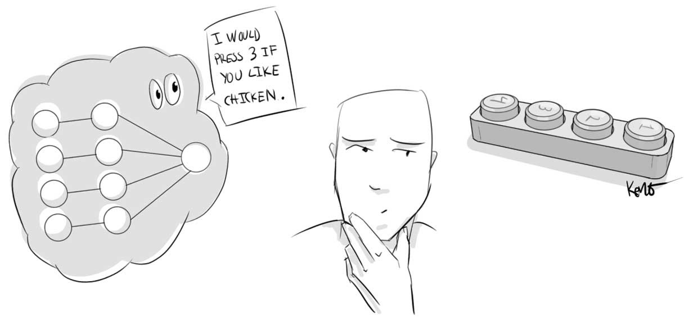

Кроме того, это масштабируемая модель, игрушка и инструмент обучения для вас и меня, благодаря которой мы можем больше узнать о машинном обучении, нейронных сетях и искусственном интеллекте.

**Но будьте бдительны:**

- Механизм хранения изученных весов не предусмотрен, поэтому эта нейронная сеть забывает все при обновлении или повторном запуске кода.
- Чтобы полностью обучить эту нейронную сеть, потребуется шесть повторений. Но если человек или машина будут нажимать кнопки случайным образом... это может занять некоторое время.
- Для важных вещей биологические сети имеют скорость обучения 1, так что потребуется всего одно повторение.
- Существует алгоритм обучения, напоминающий биологические нейроны, он броско называется *widroff-hoff rule* или *widroff-hoff learning*.
- Пороговое значение нейронов (1 в нашем примере) и эффекты переобучения (результат будет больше 1 при большем количестве повторений) оставлены в стороне, но они важны по своей природе и являются источником отличного и сложного поведения.
- То же актуально и для отрицательных весов.

**Примечания и дальнейшее чтение:**

Я пытался избегать математических и строгих терминов, но если вы хотите знать, мы только что создали **[персептрон](https://ru.wikipedia.org/wiki/%D0%9F%D0%B5%D1%80%D1%86%D0%B5%D0%BF%D1%82%D1%80%D0%BE%D0%BD)** - алгоритм для [обучения с учителем](https://ru.wikipedia.org/wiki/%D0%9E%D0%B1%D1%83%D1%87%D0%B5%D0%BD%D0%B8%D0%B5_%D1%81_%D1%83%D1%87%D0%B8%D1%82%D0%B5%D0%BB%D0%B5%D0%BC) [двойных классификаторов](https://ru.wikipedia.org/wiki/%D0%94%D0%B2%D0%BE%D0%B8%D1%87%D0%BD%D0%B0%D1%8F_%D0%BA%D0%BB%D0%B0%D1%81%D1%81%D0%B8%D1%84%D0%B8%D0%BA%D0%B0%D1%86%D0%B8%D1%8F) - тяжелый материал.

Биология мозга - большая тема, отчасти из-за ее недоступности и отчасти потому, что она сложна, но информации достаточно. Возможно, лучше всего начать с **[Neuroscience (Purves)](https://www.hse.ru/data/2011/06/22/1215686482/Neuroscience.pdf)** и **[Cognitive Neuroscience (Gazzaniga)](https://www.hse.ru/data/2011/06/28/1216307711/Gazzaniga.%20The%20Cognitive%20Neurosciences.pdf)**.

Я изменил и адаптировал пример кролика из **[Gateway to Memory (Gluck)](https://mitpress.mit.edu/books/gateway-memory)**, у которого есть отличное введение в графы.

Другим источником, к которому я часто обращался, был **[An Introduction to Neural Networks (Gurney)](https://www.inf.ed.ac.uk/teaching/courses/nlu./assets/reading/Gurney_et_al.pdf)**. Подойдет для удовлетворения широкого круга искателей в области искусственного интеллекта.

**Теперь на Python!** Спасибо [Ilya Anshmidt](https://medium.com/@ilyaanshmidt) за версию на Python:

```python
inputs = [0, 1, 0, 0]
weights = [0, 0, 0, 0]
desired_result = 1
learning_rate = 0.2
trials = 6

def evaluate_neural_network(input_array, weight_array):
	result = 0
	for i in range(len(input_array)):
		layer_value = input_array[i] * weight_array[i]
		result += layer_value
	print("evaluate_neural_network: " + str(result))
	print("weights: " + str(weights))
	return result

def evaluate_error(desired, actual):
	error = desired - actual
	print("evaluate_error: " + str(error))
	return error

def learn(input_array, weight_array):
	print("learning...")
	for i in range(len(input_array)):
		if input_array[i] > 0:
			weight_array[i] += learning_rate

def train(trials):
	for i in range(trials):
		neural_net_result = evaluate_neural_network(inputs, weights)
		learn(inputs, weights)


train(trials)
```

**Теперь на Go!** Спасибо [Kieran Maher](https://medium.com/@kieranmaher13) за версию на Go:

```go
package main
import (
 "fmt"
 "math"
)
func main() {
 fmt.Println("Creating inputs and weights ...")
inputs := []float64{0.00, 0.00, 1.00, 0.00}
 weights := []float64{0.00, 0.00, 0.00, 0.00}
 desired := 1.00
 learningRate := 0.20
 trials := 6
train(trials, inputs, weights, desired, learningRate)
}
func train(trials int, inputs []float64, weights []float64, desired float64, learningRate float64) {
for i := 1; i < trials; i++ {
  weights = learn(inputs, weights, learningRate)
  output := evaluate(inputs, weights)
  errorResult := evaluateError(desired, output)
fmt.Print("Output: ")
  fmt.Print(math.Round(output*100) / 100)
  fmt.Print("\nError: ")
  fmt.Print(math.Round(errorResult*100) / 100)
  fmt.Print("\n\n")
 }
}
func learn(inputVector []float64, weightVector []float64, learningRate float64) []float64 {
 for index, inputValue := range inputVector {
  if inputValue > 0.00 {
   weightVector[index] = weightVector[index] + learningRate
  }
 }
return weightVector
}
func evaluate(inputVector []float64, weightVector []float64) float64 {
 result := 0.00
for index, inputValue := range inputVector {
  layerValue := inputValue * weightVector[index]
  result = result + layerValue
 }
return result
}
func evaluateError(desired float64, actual float64) float64 {
 return desired - actual
}
```

---

*Также существует русский перевод [на Хабре](https://habr.com/ru/company/nixsolutions/blog/423647/), который дополнительно интересен комментариями.*
