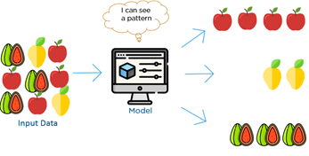
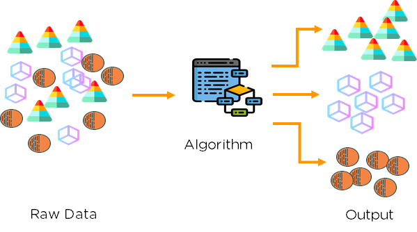
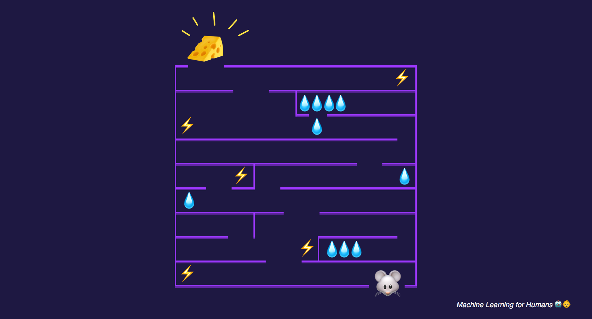
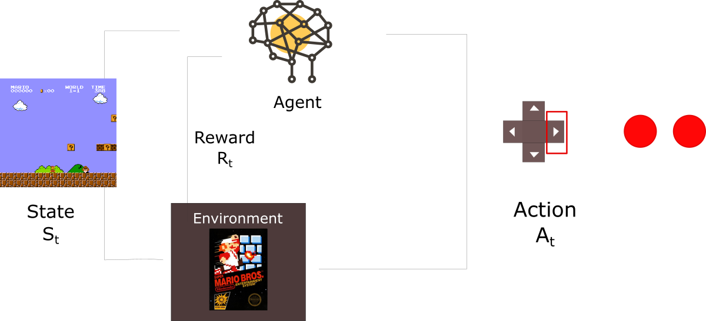

## Машинное обучение

Говоря в общем, машинное обучение - это обучение компьютерной программы или алгоритма постепенному улучшению исполнения поставленной задачи. С исследовательской стороны машинное обучение можно рассматривать через призму теоретического и математического моделирования процесса его работы. Тем не менее, на практике, это изучение того, как создавать приложения, демонстрирующие итеративное улучшение. Типы машинного обучения можно выделять по разным критериям, но вот основные три: обучение с учителем, обучение без учителя и обучение с подкреплением.

В мире, насыщенном искусственным интеллектом, машинным обучением и чрезмерным количеством разговоров о них, интересно научиться понимать и определять типы машинного обучения, с которыми можно столкнуться. Для обычного пользователя компьютера это означает понимание того, как машинное обучение проявляет себя в используемых ими приложениях. Для практиков, создающих эти приложения, важно знать типы машинного обучения, чтобы для любой конкретной задачи создать правильную среду обучения.

## Обучение с учителем

Обучение с учителем - не только самая популярная парадигма машинного обучения, но и самая простая для понимания и реализации. Она очень похожа на обучение ребенка с использованием карточек.

Имея данные в виде примеров с метками, мы можем подавать алгоритму их один за другим, дожидаться прогноза и давать обратную связь: предсказал ли он правильно или нет. Со временем алгоритм научится приближаться к точному предсказанию отношений между примерами и их метками. Будучи полностью обученным, алгоритм сможет наблюдать никогда ранее не встречавшийся пример и предсказывать верную метку для него.

Из-за такого подхода обучение с учителем часто описывается как ориентированное на задачу: алгоритм сильно сфокусирован на одной единственной задаче. С этим типом обучения вы обязательно столкнетесь, поскольку он представлен во многих из следующих приложений:

* **Правильный подбор рекламы**. Выбор хорошо работающей рекламы часто является задачей обучения с учителем. Многие встречаемые вами объявления размещаются именно на этом ресурсе, потому что обученный алгоритм сказал, что они уже имели популярность и кликабельность именно здесь.

* **Классификация спама**. Если вы используете электронную почту, скорее всего, вы сталкивались с спам-фильтром. Этот спам-фильтр - система, обученная с учителем. Системы почтовых рассылок учатся, как превентивно отфильтровывать вредоносные письма и учитывать предпочтения пользователя.

* **Распознавание лиц**. Если вы используете Facebook, то ваше лицо использовалось в алгоритме обучения с учителем: вы загружаете фотографию, система находит на ней лица, определяет конкретного человека, а затем предлагает вам отметить его на фото.

## Обучение без учителя

Обучение без учителя во многом противоположность обучения с учителем. Здесь данные не имеют меток. Вместо этого алгоритм получает в свое распоряжение много, очень много, данных и инструментов для понимания их свойств. Благодаря этому он может научиться группировать и организовывать старые данные в новые таким образом, чтобы человек (или другой интеллектуальный алгоритм) смог понять их смысл.

Обучение без учителя интересно тем, что подавляющее большинство данных в этом мире не имеет меток. Наличие алгоритмов, способных извлекать терабайты и терабайты непомеченных данных и осмысливать их, является огромным источником потенциальной прибыли для многих отраслей.

Например, если бы у нас была большая база данных по каждой когда-либо опубликованной исследовательской работе, то мы могли бы обучить алгоритм, который бы знал, как сгруппировать данные таким образом, чтобы мы всегда были в курсе текущего прогресса в конкретной области знаний. Алгоритм мог бы предлагать нам связанные работы для цитирования или дальнейшего изучения. С таким инструментом производительность значительно повысилась бы.

Поскольку обучение без учителя основано на данных и их свойствах, мы можем смело утверждать, что оно исходит от данных. Результаты обучения без учителя контролируются данными и способом их представления. Вот некоторые области, где вы можете столкнуться с обучением без учителя:

* **Системы рекомендаций**. Если вы когда-либо пользовались YouTube или Netflix, вы, скорее всего, сталкивались с системой рекомендаций по видео. Она обладает информацией о видео (длина, жанр и так далее) и знает историю просмотров многих пользователей. Принимая во внимание пользователей, которые смотрели похожие на ваши видео, а затем наслаждались другими (теми, которые вы еще не смотрели), система рекомендаций может проследить взаимосвязь и предложить интересное видео именно для вас.

* **Потребительские предпочтения**. Вероятно, ваши потребительские предпочтения лежат в огромных базах данных и в настоящее время активно покупаются и продаются. Такие предпочтения могут использоваться в алгоритмах обучения без учителя, чтобы группировать клиентов по сегментам, что в свою очередь позволяет компаниям строить более продвинутые рекомендательные системы.

* **Группировка проблем пользователей** помогает компаниям определить основные проблемы клиентов, чтобы затем исправить их, улучшить продукт или разработать гайд по решению наиболее распространенных проблем.

## Обучение с подкреплением

Обучение с подкреплением значительно отличается от обучений с учителем и без, между которым мы легко можем проследить разницу: наличие или отсутствие меток. Я предпочитаю смотреть на обучение с подкреплением как на обучение на ошибках. Поместите алгоритм обучения с подкреплением в любую среду и в начале он будет совершать много ошибок, однако мы будем подавать алгоритму положительный или отрицательный сигнал, который свяжет его поведение с положительным или отрицательным результатами. Таким образом мы можем улучшить наш алгоритм, отдавая предпочтение хорошему поведению, а не плохому. Со временем алгоритм обучения с подкреплением научится делать меньше ошибок, чем раньше.

Обучение с подкреплением базируется на поведении. Оно черпает вдохновение в области нейробиологии и психологии. Если вы слышали о собаке Павлова, то, возможно, вы уже знакомы с идеей усиления агента, хотя и биологического.

Однако, чтобы по-настоящему понять обучение с подкреплением, давайте разберем конкретный пример и посмотрим на обучение агента играть в игру Марио. Для любой проблемы обучения с подкреплением нам нужен агент и среда, а также способ соединить их петлей обратной связи. Чтобы подключить агент к среде, мы предоставляем ему набор действий, которые он может предпринять и которые влияют на среду. Чтобы подключить окружение к агенту, мы постоянно посылаем агенту два сигнала: обновленное состояние и вознаграждение (наш подкрепляющий сигнал).

В игре Марио наш агент - алгоритм обучения, а наша среда - игра (скорее всего, определенного уровня). У агента есть множество действий - состояния игровых кнопок. Обновление состояния происходит при смене каждого игрового кадра, а сигнал - изменение счета. До тех пор, пока мы соединяем все эти компоненты вместе, мы строим сценарий обучения с подкреплением для игры Марио.

Где используется обучение с подкреплением в реальном мире?

* **Видеоигры**. Одно из самых распространенных мест применения обучения с подкреплением - обучение игре в игры. Посмотрите на приложения AlphaZero и AlphaGo, которые научились играть в игру Go. Наш пример Марио также является распространенным примером. В настоящее время я не знаю ни одной массовой игры, в которой агент обучения с подкреплением был бы использован в качестве игрового искусственного интеллекта, но я могу предположить, что скоро это будет основным вариантом для разработчиков игр.

* **Промышленное моделирование**. Для многих роботизированных приложений (например, сборочных линий) полезно, чтобы машины учились выполнять свои задачи без необходимости императивного программирования. Это помогает сэкономить и повысить безопасность. Мы также можем стимулировать машины использовать меньше электроэнергии и, более того, мы можем разрабатывать все это виртуально, чтобы не тратить деньги и ничего не сломать физического.

* **Управление ресурсами**. Обучение с подкреплением полезно для принятия решения в сложных условиях. Взять, к примеру, дата-центры Google. Они используют обучение с подкреплением, чтобы уравновесить затраты на электроэнергию и качество оказываемой услуги. Как это влияет на обычного человека? Хранение данных дешевле, а влияние на окружающую среду меньше.

## Связываем все вместе

Теперь, когда мы обсудили три разных типа машинного обучения, важно отметить, что во многих случаях границы между ними стираются. Более того, существует множество задач, которые легко формулируются как один тип обучения, а затем преобразовываются в другую парадигму.

Например, возьмите систему рекомендаций. Мы обсуждали ее как задачу обучения без учителя, но она также может быть легко переформулирована как задача обучения с учителем: учитывая огромное множество историй просмотров пользователей, предсказать, следует ли рекомендовать определенный фильм или нет. Причина кроется в том, что в конечном итоге любое обучение - это обучение. Все зависит от того, как мы сформулируем проблему. Просто определенные задачи легче сформулировать так, а не иначе.

Отсюда следует вывести еще одну интересную идею. Мы можем смешивать типы обучения, проектируя системы, которые учатся тем или иным способом, но объединяются в один более крупный алгоритм.

* Агент, играющий в Марио? Почему бы не дать ему способность распознавать и отмечать врагов?
* Система, классифицирующая предложения? Почему бы не дать ей стимул извлекать выгоду из определения смысла предложения?
* Хотите объединить людей в социальной сети в группы? Почему бы не добавить в процесс подкрепление, которое уточнит результаты?

Опять же, я думаю, что очень важно, чтобы все вокруг хотя бы немного разбирались в машинном обучении. Мир кардинально меняется и машинное обучение все больше проникает в нашу повседневную жизнь. Понимание основ поможет лучше ориентироваться в мире, демистифицировать то, что может показаться магией, и позволит лучше рассуждать об используемой технологии.
